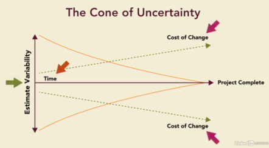

# Agile Mindset
- It might be more efficient to have generalists instead of specialists.
- It also might make sense to focus on short-term planning.
### Managing people in a factory VS in a software project
- You can't direct a team of people who collectively know more about the product than anyone else in management.
- So you have managers becoming less directive and more supportive. 
- One of the key things that you see with agile teams is this push to be self organized
- You focus on having collective decision making.
### Traditional Planning
1. Plan the project
2. Execute the project
3. Test the project
### Agile Mindset
 - Balance between making decisions and having enough flexibility to make changes
 - Most software products have to deal with something called the cone of uncertainty.
 
### Agile Manifesto

### Agile Principles  
- __P2:__ Welcoming ***Changes*** when you're working in your cone of uncertainty.   
- __P3, P7:__ Continuous software delivery in weeks as a measure of progress (***Sprints***).  
- __P4:__ Business people and developers must work together daily throughout the project (***Product Owner***).  
- __P11, P5:__ Most agile teams are cross functional and self organized (Small teams of ***Generalists***).  
- __P6:__ Importance of face to face conversations (***User Stories***).  
- __P1, P8, P9, P10:__ The product owner will identify what the customer ***Values the Most*** to be delivered in a short sprint.  
- __P12:__ Encourages the team to meet frequently to discuss process improvement (***Stand-ups***).

