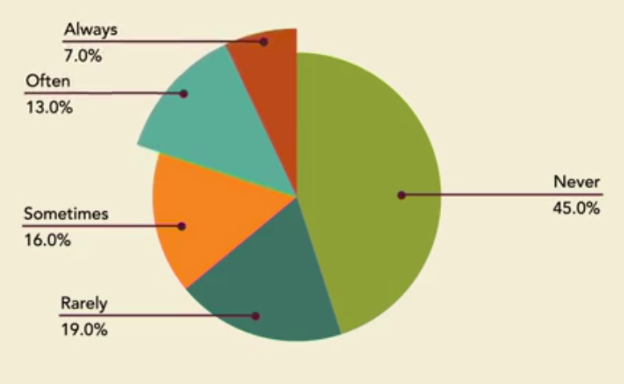

# Agile Mindset
- It might be more efficient to have generalists instead of specialists.
- It also might make sense to focus on short-term planning.
### Managing people in a factory VS in a software project
- You can't direct a team of people who collectively know more about the product than anyone else in management.
- So you have managers becoming less directive and more supportive. 
- One of the key things that you see with agile teams is this push to be self organized
- You focus on having collective decision making.
### Traditional Planning
1. Plan the project
2. Execute the project
3. Test the project
### Agile Mindset
 - Balance between making decisions and having enough flexibility to make changes
 - Most software products have to deal with something called the cone of uncertainty.
 
### Agile Manifesto

### Agile Principles  
- __P2:__ Welcoming ***Changes*** when you're working in your cone of uncertainty.   
- __P3, P7:__ Continuous software delivery in weeks as a measure of progress (***Sprints***).  
- __P4:__ Business people and developers must work together daily throughout the project (***Product Owner***).  
- __P11, P5:__ Most agile teams are cross functional and self organized (Small teams of ***Generalists***).  
- __P6:__ Importance of face to face conversations (***User Stories***).  
- __P1, P8, P9, P10:__ The product owner will identify what the customer ***Values the Most*** to be delivered in a short sprint.  
- __P12:__ Encourages the team to meet frequently to discuss process improvement (***Stand-ups***).

### Avoid Multitasking  
Instead of working on several different things at once, the entire team will focus on a limited set of high value tasks

### Avoid Hand-offs (Penny game)
- If you can keep your batches of work sizes smaller, it will make it easier to limit your handoffs.
- Penny game shows that while individual productivity decreases, the overall productivity of the whole team will increase.
- The most productive way is by moving around small batches work and eliminating handoffs even if your own productivity decreases.

### Deliver at a Predictable Pace 
 Short-term predictable delivery over long-term plans with an uncertain outcome.

### User Story
- Product owners should creat the best possible user stories.
- General Sample: As a user, I want some feature so that I can get some value.
- As a restaurant owner, I want to be able to put my menu online so that people will be interested in my restaurant.
- The restaurant owner doesn't talk about upload buttons or databases, they just care about the __value__.
- Make sure they take the time to write __clear__ stories with a __simple__ value statement.

### Requirements VS user stories
Requirements are designed to limit the conversation. A good requirements document will be very clear and tell the developer exactly what to do. User stories are a note to have a future conversation. It isn't designed to show the answers, instead it helps the team ask the right questions.

### Sample user stories:
- As a restaurant owner, I want to be able to print out, email and text my reservation list so that we know how many people to expect.
  - It has a long list of value statements, so it's really three stories in one. (Difficult to estimate and deliver).
- As a customer, I want an email copy of my receipt so that I can have it on my phone.
  - This story doesn't have a clear value statement. (Why the customer might value a copy on their phone).
  - Maybe they're keeping track of their expenses. The team would want to know this value so they can better deliver the product.
- As a developer, I want to design the database tables so that the restaurant owner can add reservation information. 
  - This user story probably came from a requirements document.
  - It talks about technical requirements and is not written from the perspective of the customer.

### Pareto Principle (80/20 Rule)
Software features that are user by customers:  

- This 20% is the most valuable part of the software (__Often__ and __Always__ used)
- Agile team should start the very frist 20% first.
- This would be part of the highest priority featured delivered in the very first sprint.

### Avoid PowerPoint
- We need to deliver small, fully-functional features of the product to the customer in iterations or sprints
- Agile team doesn't think about software as a __project__, instead it thinks of it as a __product__ that has prioritized value that you deliver

###  Embracing Change / Inspect and adapt
- Agile teams welcome changing requirements even late in development (Principle 2).
- Two of the most popular software development methods are __scrum__ and __extreme programming__.
 
 ### Stay within timeboxes (2 weeks sprint)
 -  Agile teams focus on being predictable instead of creating detailed plans (delivering predictably every few weeks).
 -  We can't have meetings that go over schedule or brainstorming sessions. That's because your team has a deadline every few weeks (sprints).
 - If your meeting is scheduled for 45 minutes then the meeting will end in 45 minutes. Whatever your team decides within that timebox.
