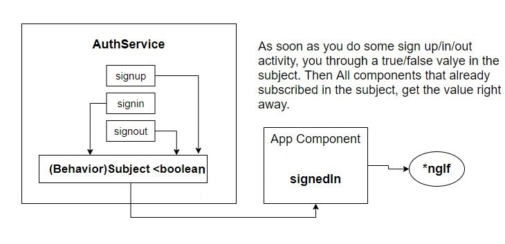

# RxJS:
## Http Call Details using RxJS (Angular 9):
Sample API call: <https://en.wikipedia.org/w/api.php?action=query&list=search&srsearch=Nelson%20Mandela&utf8=&format=json>
### app.module.ts:
```javascript
import { HttpClientModule } from '@angular/common/http';

@NgModule({
  declarations: [
    AppComponent
  ],
  imports: [
    BrowserModule, HttpClientModule
  ],
  providers: [],
  bootstrap: [AppComponent]
})
```
### Service:
pluck returns a new __Observable__ of property values from the source values.
```javascript
import { Injectable } from '@angular/core';
import { HttpClient } from '@angular/common/http';

interface WikipediaResponse{
  query: {
    search: {
      title: string;
      snippet: string;
      pageid: number;
    }[];
  }  
}

@Injectable({
  providedIn: 'root'
})
export class WikipediaService {
  constructor(private http: HttpClient) {}

  public search(term: string) {
    return this.http.get<WikipediaResponse>('https://en.wikipedia.org/w/api.php', {
      params: {
        action: 'query',
        format: 'json',
        list: 'search',
        utf8: '1',
        srsearch: term,
        origin: '*'
      }
    })
    .pipe(pluck('query', 'search'));
  }
}
```
### Component without RxJS Pluck:
```javascript
import { Component, Injectable, ReflectiveInjector } from '@angular/core';
import { WikipediaService } from './wikipedia.service';

@Component({
  selector: 'app-root',
  templateUrl: './app.component.html',
  styleUrls: ['./app.component.css']
})
export class AppComponent {
  pages = [];

  constructor(private wikipedia: WikipediaService) {}

  onTerm(term: string) {
    this.wikipedia.search(term).subscribe((response: any) => {
      this.pages = response.query.search;
    });
  }
}
```
### Component with RxJS Pluck:
```javascript
  onTerm(term: string) {
    this.wikipedia.search(term).subscribe((pages) => {
      this.pages = pages;
    });
  }
}
```
## mergeMap VS switchMap:
- *mergeMap* is best used when you wish to flatten an inner observable. It hijacks the value flowing through pipes and creates a new Observable.
- Using *switchMap* each inner subscription is completed when the source emits, allowing only one active inner subscription.

```javascript
import { Component, OnInit } from '@angular/core';
import { timer, Observable, of } from 'rxjs';
import { mergeMap, switchMap, tap } from 'rxjs/operators';


@Component({
  selector: 'app-comp1',
  templateUrl: './comp1.component.html',
  styleUrls: ['./comp1.component.css']
})
export class Comp1Component implements OnInit {

  constructor() { }

  ngOnInit(): void {

    new Observable((observer) => {
      observer.next(10)
      observer.next(20)
      observer.next(30)
    }).pipe(
      mergeMap((val: number) => timer(val * 100)),
      tap((val) => console.log(val))
    ).subscribe(()=>{})
  }
}
```
## Http Call for Weather Data using RxJS:
### Get Location from Browser using RxJS (Service):
```javascript
import { Observable, of } from "rxjs";
....
  getCurrentLocation() {
    return new Observable<Coordinates>((observer) => {
      window.navigator.geolocation.getCurrentPosition(
        (position) => {
          observer.next(position.coords);
          observer.complete();
        },
        (err) => observer.error(err)
      );
    });
  }
```
### Get Data from External API using RxJS (Service):
```javascript
import { HttpClient, HttpParams } from "@angular/common/http";
import { Observable, of } from "rxjs";
import { map, switchMap, pluck, mergeMap, filter, toArray, share} from "rxjs/operators";

interface OpenWeatherResponse {
  list: {
    dt_txt: string;
    main: {
      temp: number;
    };
  }[];
}
....
  getForecast() {
    return this.getCurrentLocation().pipe(
      map((coords) => {
        return new HttpParams()
          .set("lat", String(coords.latitude))
          .set("lon", String(coords.longitude))
          .set("units", "metric")
          .set("appid", "f557b20727184231a597c710c8be3106");
      }),
```
Using *switchMap* we hijack the value which is *HttpParams* and create another observable which is *http.get*.
```javascript
      switchMap((params) =>
        this.http.get<OpenWeatherResponse>(this.url, { params })
      ),
```
Out of returned object we pick out the *"list" array of objects* object.
```javascript
      pluck("list"),
```
hijacking the array and create another observable that emmits objects inside the array one by one. (we can use *from* operator with no "...")
```javascript
      mergeMap((value) => of(...value)),
```
Filter out the values based on their index and a condition (here we pick out 0,8,16,24,32 from 0-39). You can apply the filter on the __value__ or the __index__:
```javascript
      filter((value, index) => index % 8 === 0),
```
Create new object based on receiving object and dismiss the extera properties
```javascript
      map((value) => {
        return {
          dateString: value.dt_txt,
          temp: value.main.temp,
        };
      }),
```
Store flowing objects in an array. This is the opposite of *mergeMap((value) => of(...value))*
```javascript
      toArray(),
```
In the case of **multiple subscription**, the network request is made just once
```javascript
      share(),
    );
  }
```
## Observable VS Subject
* __Observable (Cold)__
  * When the observer subscribes, it emmits the value  
  * The observable itself decides what different values to be produced and emitted (inside the observable we have code that says here is the next value to emit).
* __Subject (Hot)__
  * The observable (Subject) is receiving some values from __outside__. 
  * When it emmits a value, it lets the observer know that the value has been emmited.  
  * In other words, for Subject, when you throw the value 10 i.e. ```subject.next(10)``` it emmits the 10 right away.  
* __BehaviorSubject__
  * Takes an initial value. Always emits the most recent value and notify the subscribers as soon as you throw a value in.  
* __ReplaySubject__
  * Get all values that already have been emmited.  
## Scan Operator
Applies an accumulator function over the source Observable, and returns each intermediate result, with an optional seed value.
```javascript
    this.messages = new Subject<Command>().pipe(
      scan((acc, value) => {
        if (value.type === 'clear') {
          return acc.filter(message => message.id !== value.id);
        } else {
          return [...acc, value];
        }
      }, [])
    );
```
## Scan VS Reduce
Scan emits each successive value VS Reduce emits the final value
```javascript
import { of } from 'rxjs';
import { reduce, scan } from 'rxjs/operators';

const source = of(1, 2, 3, 4);
const example = source.pipe(scan((acc, val) => acc + val));
const subscribe = example.subscribe(val => console.log('Sum:', val));
```
Output: ```Sum: 1``` ```Sum: 3``` ```Sum: 6``` ```Sum: 10```
```javascript
const example = source.pipe(reduce((acc, val) => acc + val));
```
Output: ```Sum: 10```
## Using Subject to handle Signed-In boolean key across the App
We use this approach whenever we are writing a service that has some data inside of it that needs to communicate that data to some outside components.  
 

## take & skipWhile Operators (316, Stephen)
```javascript
import { Observable } from 'rxjs';
import { take, skipWhile } from 'rxjs/operators';
import { AuthService } from './auth.service';

@Injectable({
  providedIn: 'root'
})
export class AuthGuard implements CanLoad {
  constructor(private authService: AuthService) {}

  canLoad(
    route: Route,
    segments: UrlSegment[]
  ): Observable<boolean> | Promise<boolean> | boolean {
    return this.authService.signedin$.pipe(
```
__skipWhile__ receives the value and returns True/False. in case of True it does not allow the value to continue flowing.
```javascript
      skipWhile(value => value === null),
```
__Take__ allows __One(1)__ value comes out of the observable and then mark the observable as __Complete__
```javascript
      take(1)
    );
  }
}
```
