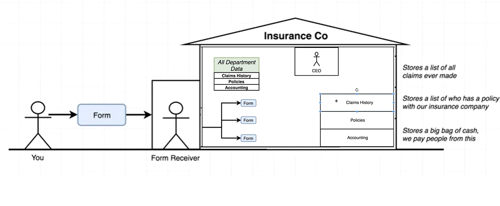

# Redux Structure



## Immutability in JS
JS is not a good language for Immutability. **Arrays** and **objects** are mutable in JS:

```javascript
const a = ["a", "f", "y", "r", "b"];
console.log(a);  //["a", "f", "y", "r", "b"];
const b =a.sort();
console.log(a);  //["a", "b", "f", "r", "y"]
```
```javascript
const a = ["a", "f", "y", "r", "b"];
console.log(a);  //["a", "f", "y", "r", "b"];
const b =[...a].sort();
console.log(a);  //["a", "f", "y", "r", "b"];
```

Functions like **map**, **slice**, **filter** are non-destructive as well.
```javascript
const a = ["a", "f", "y", "r", "b"];
const c = a.map(data=>data).sort()
console.log(c);  //["a", "b", "f", "r", "y"];
console.log(a);  //["a", "f", "y", "r", "b"];
```

Objects Immutability.
```javascript
const state = {
name: 'Jon Snow',
occupation: 'Lord Commander',
skills: [] // knows nothing...
}
const newState = {
...state,
occupation: 'King in the North',
skills: [...state.skills, 'Fighting', 'Test']
};

console.log(newState)
//{
//  name:"Jon Snow",
//  occupation:"King in the North",
//  skills:[
//    "Fighting",
//    "Test"
//    ]
//}
```

# NgRx Introduction
- NgRx is a group of libraries inspired by the Redux pattern. The main purpose of this pattern is to provide a predictable state container, based on three main principles:
  - **Single source of truth**  
    In the case of a redux/ngrx architecture, this means that the state of your whole application is stored in an object tree within a single store.
  - **State is read-only**  
    You are never going to change the state directly instead you are going to dispatch actions.
  - **Changes are made with pure functions**  
    The operation triggered by dispatching an action is going to be a pure function (any function that doesn’t alter input data) called reducers. The reducer function takes an object that represents the “old” state, then creates a brand new object by copying all the old object’s details into a it and **overriding** old properties with new ones.  
    Redux takes a given state (object) and passes it to each reducer in a loop. And it expects a brand new object from the reducer if there are any changes. And it also expects to get the old object back if there are no changes.Redux simply checks whether the old object is the same as the new object by comparing the memory locations of the two objects. So if you mutate the old object’s property inside a reducer, the “new state” and the “old state” will both point to the same object. Hence Redux thinks nothing has changed! So this won’t work.
  - **Change detection**      
    The main benefit is that by binding all our components inputs to state properties we can change the change detection strategy to on push, and this is going to be a boost on performance for the application.
    
- NgRx libraries installation (other elements of the store should be installed individually):
```code
ng add @ngrx/store@latest
```

- NgRx flow:


## File Structure

- For Each module we can create a Store and register the store on `appName.module.ts`
- Store includs the following folders: 
  - `counter.actions.ts`
  - `counter.reducer.ts`
  - `counter.selectors.ts`
  - `counter.state.ts`
  - `counter.effects.ts`
  
## Store Elements Sample Code

1- `counter.state.ts`:

- By default it includs the **State Interface** & **Initial State**.

```javascript
export interface CounterState {
  counter: number,
  channelName:string
}
export const initialState = {
  counter: 0,
  channelName:'Reza from Citi'
}    
```

2- `counter.actions.ts`

- Any Component tells give me something or update something. It is **Actions** (with or without Data):

```javascript
import { createAction, props } from '@ngrx/store'

export const increment = createAction('increment')
export const customIncrement = createAction('customincrement', props<{ count: number }>())
```

- **ES6** Format:

```javascript
import { createAction } from '@ngrx/store'

export const increment = createAction('increment')
export const customIncrement = createAction('customincrement', (count: number)=>({count}))
```

3- `counter.reducer.ts`

- Adding the business logic for each Actions:

```javascript
import { createReducer, on } from '@ngrx/store'
import { customIncrement, increment } from './counter.actions'
import { initialState } from './counter.store'

const _counterReducer = createReducer(
  initialState,
  on(increment, (state) => {
    return {
      ...state,
      counter: state.counter + 1,
    }
  }),
  on(customIncrement, (state, action) => {
    return {
      ...state,
      counter: state.counter + action.count,
    }
  })
)

export function counterReducer(state, action) {
  return _counterReducer(state, action)
}
```

4- `app.module.ts`

- Register the reducer on App Module (Assign **counter** as the Reducer Name):

```javascript
import { StoreModule } from '@ngrx/store'
import { counterReducer } from './counter/store/counter.reducer'

@NgModule({
  declarations: [AppComponent, ....],
  imports: [
    StoreModule.forRoot({ counter: counterReducer }),
  ],
})
export class AppModule {}
```

5- `counter.selectors.ts`

- Selector is a query of store (getting a slice of store):

```javascript
import { createFeatureSelector, createSelector } from '@ngrx/store'
import { CounterState } from './counter.store'

const getCounterState = createFeatureSelector<CounterState>('counter')

export const getCounter = createSelector(getCounterState, (state) => {
  return state.counter
})
```

- Selector with props:

```javascript
import { createFeatureSelector, createSelector } from '@ngrx/store'
import { PostsState } from './posts.state'

export const getPostById = (id: string) =>
  createSelector(getPostsState, (state) => {
    return state.posts.find((post) => post.id === id)
  })
})


//in the Component:
  this.store.select(getPostById(id)).subscribe(data=>{
    this.post = data
  })
```

## Define a Application level Store

- We can create a separate store for each module and integrate all in an application level store
- **appReducer** will be registered in app.module.ts istead of all other reducers

1- `app.state.ts`:

```javascript
export interface AppState {
  counter: CounterState
  posts: PostsState
}

export const appReducer = {
    counter:counterReducer,
    posts:postsReducer,
} 
```

4- `app.module.ts`

```javascript
import { StoreModule } from '@ngrx/store'
import { appReducer } from './store/app.state'

@NgModule({
  declarations: [AppComponent, ....],
  imports: [
    StoreModule.forRoot(appReducer)
  ],
})
export class AppModule {}
```

5- `counter-buttons.component.ts`

- Injecting new store in component level

```javascript
import { Store } from '@ngrx/store'
import { AppState } from 'src/app/store/app.state'
import { decrement, increment, reset } from '../store/counter.actions'

export class CounterButtonsComponent implements OnInit {
  counter$: Observable<number>
  constructor(private store: Store<AppState>) {}
  
  ngOnInit() {
    this.counter$ = this.store.select(getCounter)
  }
  
  onIncrement() {
    this.store.dispatch(increment())
  }
 } 
```
## Adding App.Module with Routing for Lazy Loading 
https://github.com/rezanikfal/NGRX/commit/18d124ec44ca8edf47b481f17fbbd643f6c99814
## Lazy load the ngrx state using StoreModule.forFeature
- If we load the state data across multiple modules keep it as `StoreModule.forRoot(appReducer)` in `app.module.ts`
- If we load the state data just in one modules keep it as `StoreModule.forFeature(COUNTER_STATE_NAME, counterReducer)` in `counter.module.ts`
- https://github.com/rezanikfal/NGRX/commit/12a0f096e814a642962b18a0f9fcba43ad5cec22
## NgRx Effects
- Effects takes the action, does some work and again dispatches new action.
- This could be success or the fail action.
