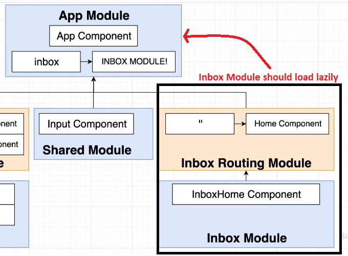

## Routes and Paths
To create a module with routing we should run ```ng g m Reza --routing``` the outcome is 2 files as follows in ```reza``` folder:
- ```reza-routing.module.ts```
- ```reza.module.ts```
## Routing module in Root and user-defined modules
- Routing modules is basically duplicating a module file to define routes
- We can create the routing in the main module file as well
- User-defined modules
```javascript
import { NgModule } from '@angular/core';
import { RouterModule, Routes } from '@angular/router';

const routes: Routes = [];

@NgModule({
  imports: [RouterModule.forChild(routes)],
  exports: [RouterModule]
})
export class MyMod11RoutingModule { }
```
- The `forChild()` method is used to define routes specific to this **particular feature module**.
- Root modules
```javascript
import { NgModule } from '@angular/core';
import { RouterModule, Routes } from '@angular/router';

const routes: Routes = [];

@NgModule({
  imports: [RouterModule.forRoot(routes)],
  exports: [RouterModule]
})
export class AppRoutingModule { }
```
- `RouterModule.forRoot(routes)` is used to configure the main (root) routing for your **entire application**.
- Define Routes:
```javascript
const routes: Routes =
[{ path: 'my/path/', component: MyComponent },
{ path: 'products', pathMatch: 'full', component: ProductListComponent},
{ path: '',  redirectTo: '/products', pathMatch: 'full' },
{ path: 'users/:id', component: UserProfileComponent },
{ path: '**', component: WildcardComponent }]
```
- Let's say the parent path is `localhost:4200/abc`, Here is the **Relative** and **Absolute** Path:
```javascript
//Relative
const routes: Routes = [
  { path: '', component: HomeComponent },  //localhost:4200/abc
  { path: 'home', component: HomeComponent },  //localhost:4200/abc/home
  { path: 'about', component: AboutComponent }  //localhost:4200/abc/about
];
//Absolute
const routes: Routes = [
  { path: '/about', component: AboutComponent }  //localhost:4200/about
];
```
- `Path: '\'` is not valid.
### Route dynamic parameters
- When you see a colon (:) followed by a name (e.g., :id) in a route path, it indicates that this part of the route is a parameter, and its value will be dynamic.
- Retrieve the Parameter in the Component
```javascript
import { Component, OnInit } from '@angular/core';
import { ActivatedRoute } from '@angular/router';

@Component({
  selector: 'app-user-profile',
  templateUrl: './user-profile.component.html',
  styleUrls: ['./user-profile.component.css']
})
export class UserProfileComponent implements OnInit {

  userId: string;

  constructor(private route: ActivatedRoute) { }

  ngOnInit(): void {
    // Subscribe to the route parameters to get the 'id' value
    this.route.paramMap.subscribe(params => {
      this.userId = params.get('id');
      // You can use this userId to fetch user data from a service, for example:
      // this.userService.getUserById(this.userId).subscribe(...);
    });
  }

}
```
- Navigating to the Route:
```javascript
this.router.navigate(['/users', userId]);
<a [routerLink]="['/users', userId]">View Profile</a>
```
### PathMatch
The default path-match strategy is **prefix**, which means that the router checks URL elements from the left to see if the URL matches a specified path.You can specify the path-match strategy __full__ to make sure that the path covers the whole unconsumed URL.
### HttpRequest 
- The `http.request` method in Angular's `HttpClient` is a powerful and flexible way to make HTTP requests.
```javascript
    const uploadReq = new HttpRequest('POST', '/upload', formData, {
      reportProgress: true,
    });

    return this.http.request(uploadReq);
```
### HTTP POST
```javascript
post(url: string, 
     body: any, 
     options: { 
        headers?: HttpHeaders | { [header: string]: string | string[]; }; 
        observe?: "body|events|response|"; 
        params?: HttpParams | { [param: string]: string | string[]; }; 
        reportProgress?: boolean; 
        responseType: "arraybuffer|json|blob|text"; 
        withCredentials?: boolean; 
     }
): Observable
```
- headers : use this to send the HTTP Headers along with the request
- params: set query strings / URL parameters
- observe: This option determines the return type.
- responseType: The value of responseType determines how the response is parsed.
- reportProgress: Whether this request should be made in a way that exposes progress events.
- withCredentials: Whether this request should be sent with outgoing credentials (cookies).

### Lazy Loading
- Lazy loading speeds up application load time by splitting the application into multiple bundles and loading them on demand.
- We can directly Lazily load a component ouside of the current moduel i.e. ```LazyComponent``` in the Lazy module(22).
```javascript
import { NgModule } from '@angular/core';
import { Routes, RouterModule } from '@angular/router';
const routes: Routes = 
[{ path: 'my/path/', component: MyComponent },
{
  path: 'lazy',
  loadChildren: () => import('./lazy-route/lazy.module').then(mod => mod.LazyModule),
},
{ 
  path: 'lazy2',
  component: LazyComponent,
  loadChildren: () => import('./lazy/lazy.module22').then(m => m.LazyModule22)
}];
```
#### Lazy loading in Email Client App
   

inbox-routing.module.ts:  
```javascript
import { NgModule } from '@angular/core';
import { Routes, RouterModule } from '@angular/router';

import { HomeComponent } from './home/home.component';

const routes: Routes = [{ path: '', component: HomeComponent }];

@NgModule({
  imports: [RouterModule.forChild(routes)],
  exports: [RouterModule]
})
export class InboxRoutingModule {}
```

app-routing.module.ts:  
```javascript
import { NgModule } from '@angular/core';
import { Routes, RouterModule } from '@angular/router';

const routes: Routes = [
  {
    path: 'inbox',
    loadChildren: () =>
      import('./inbox/inbox.module').then(mod => mod.InboxModule)
  }
];

@NgModule({
  imports: [RouterModule.forRoot(routes)],
  exports: [RouterModule]
})
export class AppRoutingModule {}
```
### RedirectTo
Instead of duplicating path, just redirect to the home path. Make sure pathMatch is full otherwise it redirects for all other paths
```javascript
{ path: '',  redirectTo: '/home', pathMatch: 'full' }
{ path: '/home', component: home }
```
### Programmatic Navigation
- Injecting the _Router_ service and make use of it to navigate to another URL
- The ```navigate``` method is used for navigating based on a provided array of commands or a URL string.
```javascript
import { Component, OnInit } from '@angular/core';
import { Router } from '@angular/router';
import { AuthService } from '../auth.service';

@Component({
  selector: 'app-signout',
  templateUrl: './signout.component.html',
  styleUrls: ['./signout.component.css']
})
export class SignoutComponent implements OnInit {
  constructor(private authService: AuthService, private router: Router) {}

  ngOnInit() {
    this.authService.signout().subscribe(() => {
      this.router.navigateByUrl('/');
      this.router.navigate(['/heroes', { id: heroId }]); ///heres/1
    });
  }
}
```
```javascript
navigateWithParams() {
  this.router.navigate(['/']);
}

navigateWithParams() {
  this.router.navigate(['/user', 123], { queryParams: { name: 'John' } });
}

navigateWithParams() {
  this.router.navigateByUrl('/user/123?name=John');
}

navigateWithfragment() {   //It redirects to an element with id "section1" (fragment) like this: /products#section1 
this.router.navigate(['/products'], { fragment: 'section1' })
}
```
### RouterLink
- the ```routerLink``` directive is used to create links to different views in your application.
- ```href``` is a standard HTML attribute, it triggers a full-page reload, and it is typically used for static links.
- ```routerLink``` performs navigation within your Angular application. This is handling navigation within a single-page application (SPA) built with Angula.
```html
<!-- Simple Navigation -->
<a routerLink="/home">Home</a>

<!-- Navigate to a route with a parameter like /user/123 -->
<a [routerLink]="['/user', userId]">User Details</a>

<!-- Navigate to a route with query parameters like /search?term=angular -->
<a routerLink="['/search']" [queryParams]="{ term: 'angular' }">Search</a>

<!-- Navigate to a route with query parameters and fragment like /search?term=angular#sec1 -->
<a routerLink="['/search']" [queryParams]="{ term: 'angular' }" fragment="sec1">>Search</a>

<!-- Apply a CSS class when it is active -->
<a routerLink="['/home']" routerLinkActive="active-link">Home</a>

<!-- Navigate relative to the current route -->
<a routerLink="['./child']" >Child Component</a>

<!-- Navigate to a variable route (myVar = '/child')-->
<a routerLink="[myVar]" >Child Component</a>

<!-- Example of using named outlets in a navigation link -->
<a [routerLink]="[{ outlets: { sidebarOutlet: ['sidebar'], contentOutlet: ['content'] } }]">
  Go to Sidebar and Content
</a>
```
### Guard
A class that we implement to restrict access to some routes inside your application. Inside the guard we decide about accessing the user to a route. it returns __Boolean__. there are 3 types (a single guard can implement all three types simultaneously):
- __canActivate__: User can visit this route
- __canActivateChild__: User can visit this child route
- __canLoad__: User can load this __lazily-loaded__ module and access the routes inside of it

To generate guard using CLI:   
```ng g guard auth/Auth```  
Using __canLoad__ Guard in __app-routing.module.ts__ for lazily-loaded Inbox Module:
```javascript
import { NgModule } from '@angular/core';
import { Routes, RouterModule } from '@angular/router';

import { AuthGuard } from './auth/auth.guard';

const routes: Routes = [
  {
    path: 'inbox',
    canLoad: [AuthGuard],
    loadChildren: () =>
      import('./inbox/inbox.module').then(mod => mod.InboxModule)
  }
];
```
### Nesting routes:
As your application grows more complex, you may want to create routes that are relative to a component other than your root component. These types of nested routes are called child routes.
```javascript
const routes: Routes = [
  {
    path: 'first-component',
    component: FirstComponent, // this is the component with the <router-outlet> in the template
    children: [
      {
        path: 'child-a', // child route path
        component: ChildAComponent, // child route component that the router renders
      },
      {
        path: 'child-b',
        component: ChildBComponent, // another child route component that the router renders
      },
    ],
  },
];
```
### ActivatedRoute:
- **ActivatedRoute** service provides information about the route associated with a component that is loaded at a particular moment.
- The ```snapshot``` property provides provides a simple and straightforward way to access the route parameters during component initialization. But It doesn't respond to changes in route parameters after the component is initialized.
- ```this.route.data``` is an observable that allows you to subscribe to changes in the route data. It provides a reactive way to handle changes with the route.
```javascript
// The snapshot property provides a snapshot of the route information at the moment the component was created.
const snapshot = this.route.snapshot;

// The params property is an observable that allows you to subscribe to changes in route parameters.
this.route.params.subscribe(params => {
  // Handle changes to route parameters
});
const userId = this.route.snapshot.params['id'];

// The queryParams property provides an observable for changes to the query parameters of the route.
this.route.queryParams.subscribe(queryParams => {
  // Handle changes to query parameters
});
const searchQuery = this.route.snapshot.queryParams['search'];

// The fragment property provides an observable for changes to the URL fragment identifier.
this.route.fragment.subscribe(fragment => {
  // Handle changes to the fragment identifier
});
const pageSection = this.route.snapshot.fragment;

// The data property provides access to the data object associated with the route (like resolver).
    this.route.data.subscribe(data => {
      // Access the resolved data
      this.pageTitle = data.title;
    }); 
const pageTitle = this.route.snapshot.data['title'];

// The outlet property provides the name of the outlet.
const outletName = this.route.snapshot.outlet;
```
### Get information from a route/Get Id/Snapshot/Relative route:
As your application grows more complex, you may want to create routes that are relative to a component other than your root component. These types of nested routes are called child routes.
```javascript
import { Router, ActivatedRoute, ParamMap } from '@angular/router';
constructor(
  private route: ActivatedRoute,
  private router: Router
) {}
ngOnInit() {
  this.route.queryParams.subscribe(params => {
    this.name = params['name'];
  });
}
ngOnInit() {
  this.heroes$ = this.route.paramMap.pipe(
    switchMap(params => {
      this.selectedId = Number(params.get('id'));
      return this.service.getHeroes();
    })
  );
}
ngOnInit() {
  const heroId = this.route.snapshot.paramMap.get('id');
  this.hero$ = this.service.getHero(heroId);
}
goToItems() {
  this.router.navigate(['items'], { relativeTo: this.route });
}
```
### Resolver:
- A resolver is a **service** that pre-fetches some data before the route is activated.
- Resolvers are used to ensure that the required data for a component is available before the component is displayed.

```javascript
// resolver.service.ts
import { Injectable } from '@angular/core';
import { Resolve, ActivatedRouteSnapshot, RouterStateSnapshot } from '@angular/router';
import { Observable } from 'rxjs';
import { DataService } from './data.service';

@Injectable({
  providedIn: 'root'
})
export class MyResolver implements Resolve<any> {
  constructor(private dataService: DataService) {}

  resolve(route: ActivatedRouteSnapshot, state: RouterStateSnapshot): Observable<any> {
    // You can perform any data-fetching logic here
    return this.dataService.getData();
  }
}
```
```javascript
// app-routing.module.ts
import { NgModule } from '@angular/core';
import { RouterModule, Routes } from '@angular/router';
import { MyComponent } from './my.component';
import { MyResolver } from './resolver.service';

const routes: Routes = [
  {
    path: 'my-route',
    component: MyComponent,
    resolve: {
      resolvedData: MyResolver
    }
  }
];

@NgModule({
  imports: [RouterModule.forRoot(routes)],
  exports: [RouterModule]
})
export class AppRoutingModule {}
```
```javascript
// my.component.ts
import { Component } from '@angular/core';
import { ActivatedRoute } from '@angular/router';

@Component({
  selector: 'app-my',
  template: '<div>{{ resolvedData | json }}</div>'
})
export class MyComponent {
  constructor(private route: ActivatedRoute) {
    // Access the resolved data from the route
    this.route.data.subscribe(data => {
      this.resolvedData = data.resolvedData;
    });
  }
}
```
### router-outlet:
- It is a directive that serves as a placeholder where the router dynamically injects the component that corresponds to the current route.
- In Angular, each module can have its own router-outlet.
- It is possible to have multiple router-outlet elements in a single Angular module.

```javascript
// feature.module.ts
import { NgModule } from '@angular/core';
import { RouterModule, Routes } from '@angular/router';
import { MainComponent } from './main.component';
import { SidebarComponent } from './sidebar.component';
import { ContentComponent } from './content.component';

const routes: Routes = [
  {
    path: '',
    component: MainComponent,
    children: [
      {
        path: 'sidebar',
        component: SidebarComponent,
        outlet: 'sidebarOutlet', // This outlet is named 'sidebarOutlet'
      },
      {
        path: 'content',
        component: ContentComponent,
        outlet: 'contentOutlet', // This outlet is named 'contentOutlet'
      },
      // Other routes for the main component without specifying an outlet
    ],
  },
];

@NgModule({
  imports: [RouterModule.forChild(routes)],
  exports: [RouterModule],
})
export class FeatureRoutingModule {}
```
```javascript
<!-- main.component.html -->
<h2>Main Component</h2>
<router-outlet></router-outlet> <!-- This is the default outlet -->
<router-outlet name="sidebarOutlet"></router-outlet> <!-- Named outlet for the sidebar -->
<router-outlet name="contentOutlet"></router-outlet> <!-- Named outlet for the content -->
```
## Add routing to a Module
We can easily add routing to a module without a new **routing.ts** file:
### Before Routing
```javascript
import { BrowserModule } from '@angular/platform-browser';
import { AppComponent } from './app.component';
import { CounterComponent } from './counter/counter/counter.component';
import { PostsComponent } from './posts/posts/posts.component';
import { HeaderComponent } from './header/header/header.component';

@NgModule({
  declarations: [
    AppComponent,
    CounterComponent,
    PostsComponent,
    HeaderComponent
  ],
  imports: [
    BrowserModule
  ],
  providers: [],
  bootstrap: [AppComponent]
})
export class AppModule { }
```
### After Routing
```javascript
import { NgModule } from '@angular/core';
import { BrowserModule } from '@angular/platform-browser';
import { RouterModule, Routes } from "@angular/router";
import { AppComponent } from './app.component';
import { CounterComponent } from './counter/counter/counter.component';
import { PostsComponent } from './posts/posts/posts.component';
import { HeaderComponent } from './header/header/header.component';

const routes:Routes=[
  {
    path:'', component:PostsComponent
  },
  {
    path:'counter', component:CounterComponent
  }
]

@NgModule({
  declarations: [
    AppComponent,
    CounterComponent,
    PostsComponent,
    HeaderComponent
  ],
  imports: [
    BrowserModule,
    RouterModule.forRoot(routes)
  ],
  providers: [],
  bootstrap: [AppComponent]
})
export class AppModule { }
```
### Adding routs to "a" tag
```html
<ul class="navbar-nav">
  <li class="nav-item">
    <a class="nav-link active" aria-current="page" href="#" [routerLink]="['/']">Posts</a>
  </li>
  <li class="nav-item">
    <a class="nav-link" href="#" href="#" [routerLink]="['/counter']">Counter</a>
  </li>
</ul>
```
### After Lazy Loading
```javascript
const routes:Routes=[
  {
    path:'', component:PostsComponent
  },
  {
    path: 'counter', 
    loadChildren: () => import('./counter/counter.module').then(m => m.CounterModule)
  }
]

@NgModule({
  declarations: [
    AppComponent,
    PostsComponent,
    HeaderComponent
  ],
```
### Components Folder to Module with routing (for Lazy Loading)
first add the ```counter.module.ts``` to the folder and:
```javascript
import { NgModule } from '@angular/core'
import { CounterComponent } from './counter/counter.component'
import { RouterModule, Routes } from '@angular/router'
import { CommonModule } from '@angular/common'

export const routes: Routes = [
  {
    path: '',
    component: CounterComponent,
  },
]

@NgModule({
  imports: [CommonModule, RouterModule.forChild(routes)],
  declarations: [CounterComponent],
})
export class CounterModule {}
```
