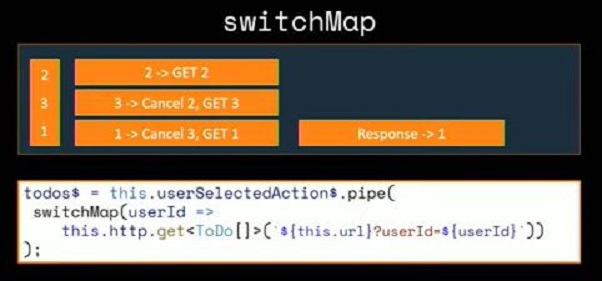
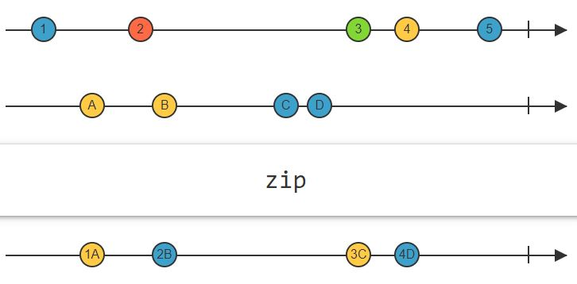

# RxJS:
### Show an Angular web page on the browser:
- When a user enters a URL in the browser and hits Enter, a request is sent to the server.
- The server processes the request and responds with the initial HTML content, which usually includes the **index.html** file.
- The browser receives the HTML content from the server.
- The browser parses the HTML content and discovers any linked stylesheets, scripts, or other resources.
- If there are script tags, like those linking to the compiled JavaScript files generated by Angular (e.g., main.js), the browser starts executing these scripts.
- The execution begins with the main.ts file, which typically includes the bootstrapping code for the Angular application.
- The Angular application is dynamically bootstrapped by the code in main.ts. Angular takes over the rendering process and starts initializing the application.
- Angular identifies the root component (e.g., AppComponent) specified in the bootstrap property of the root module (AppModule). The root component and its associated components are rendered within the <app-root> tag in the index.html file.
- The dynamic content of the Angular application is injected into the index.html file, replacing the placeholder tags such as <app-root>.
### index.html:
- It includes the following script files:
  - The **defer** attribute tells the browser not to wait for the script. Instead, the browser will continue to process the HTML, build DOM.
  - The script loads “in the background”, and then runs when the DOM is fully built.
```javascript
<body>
  <!-- ... -->
  <script src="runtime.js" defer></script>
  <script src="polyfills.js" defer></script>
  <script src="styles.js" defer></script>
  <script src="vendor.js" defer></script>
  <script src="main.js" defer></script>
</body>
```
- **runtime.js (Angular code itselfe):**
  - Contains the Angular runtime code required for bootstrapping and running the application.
- **polyfills.js:**
  - Includes polyfills for providing compatibility with various browsers and ensuring that the application runs smoothly across different environments.
- **styles.js:**
  - Contains the styles (CSS) specific to your Angular application.
- **vendor.js:**
  - Includes code from **third-party** libraries, **Angular dependencies**, and other **external modules** used in your application.
- **main.js (Our Angular components, services, pipes, ...):**
  - Contains the transpiled and bundled code from your main.ts file, which is the entry point of your Angular application.

### main.ts:
- The ```main.ts``` file in an Angular application is the entry point of your application.
- Angular knows about the ```main.ts``` file being the entry point because it's specified in the project configuration in the ```angular.json``` file.
- ```enableProdMode``` is used to enable production mode, which can enhance the performance of your application.
- ```platformBrowserDynamic``` is used to dynamically bootstrap the application in a browser environment.
- ```AppModule``` is the root module of application. It's defined in the ```@NgModule``` decorator in the app.module.ts file.
```javascript
import { enableProdMode } from '@angular/core';
import { platformBrowserDynamic } from '@angular/platform-browser-dynamic';

import { AppModule } from './app/app.module'; // Import your root module
import { environment } from './environments/environment';

if (environment.production) {
  enableProdMode();
}

platformBrowserDynamic().bootstrapModule(AppModule)
  .catch(err => console.error(err));
```
### Pass data between sibling components:
- It's a good practice to expose observables instead of subjects to external components. This is because subjects allow direct access to the next method, which could be misused and lead to unintended behavior.
- If we use ```BehaviorSubject```, we can retrive the data with no subscription (Sync): ```this.mySubject2.value```
- Accessing value is synchronous, meaning it retrieves the current value immediately.
```javascript
import { Injectable } from '@angular/core';
import { Subject } from 'rxjs';

@Injectable({
  providedIn: 'root',
})
export class ShareServiceService {
  constructor() {}

  private mySubject = new Subject();

  myData = this.mySubject.asObservable();

  setData(data: any) {
    this.mySubject.next(data);
  }
}
```
```javascript
import { Component } from '@angular/core';
import { ShareServiceService } from '../share-service.service';

@Component({
  selector: 'app-copm1',
  templateUrl: './copm1.component.html',
  styleUrl: './copm1.component.css',
})
export class Copm1Component {
  constructor(private share: ShareServiceService) {}

  triggerSubject() {
    this.share.setData('Hi');
  }
}
```
```javascript
import { Component } from '@angular/core';
import { ShareServiceService } from '../share-service.service';

@Component({
  selector: 'app-copm2',
  templateUrl: './copm2.component.html',
  styleUrl: './copm2.component.css',
})
export class Copm2Component {
  data: any;
  constructor(private share: ShareServiceService) {}

  ngOnInit() {
    this.data = this.share.myData; // To render the data on HTML, use {{ data | async }}
  }
}
```
### ViewChild and ViewChildren:
- They are decorators that are used to query and access
  -  Child components
  -  Elements within a component's view
- They are often used in combination with the **ngAfterViewInit**
- ```ngAfterViewInit``` is a lifecycle hook that is called after the view of the component and its child views have been initialized
-  ```#appComp1``` is a **template reference variable**.
- The ```@ViewChild``` decorator allows you to query and access the **first** instance of a child component
- ```@ViewChildren``` decorator allows you to query and access multiple instances of child components or directives in the template.

```javascript
// comp1.component.ts
import { Component } from '@angular/core';
import { ShareServiceService } from '../share-service.service';

@Component({
  selector: 'app-copm1',
  templateUrl: './copm1.component.html',
  styleUrl: './copm1.component.css',
})
export class Copm1Component {
  constructor(private share: ShareServiceService) {}

  triggerSubject() {
    console.log('Hello');
  }
}
```

```html
<!-- app.component.html -->
<app-copm1 #appComp1></app-copm1>
<app-copm2></app-copm2>
<div #divHello>Hello</div>
```

```javascript
// app.component.ts
import { AfterViewInit, Component, ElementRef, ViewChild } from '@angular/core';
import { Copm1Component } from './copm1/copm1.component';

@Component({
  selector: 'app-root',
  templateUrl: './app.component.html',
  styleUrls: ['./app.component.css'],
})
export class AppComponent implements AfterViewInit {
  @ViewChild('appComp1') app1!: Copm1Component; // You can use the appComp1 class name also: @ViewChild(Copm1Component)
  @ViewChild('divHello') myDiv!: ElementRef;

  ngAfterViewInit(): void {
    this.app1.triggerSubject();
    const divElement: HTMLDivElement = this.myDiv.nativeElement;
    divElement.innerHTML = 'Reza';
  }
}
```
```html
<!-- app.component.html -->
    <app-child></app-child>
    <app-child></app-child>
```
```javascript
// app.component.ts
import { AfterViewInit, Component, ElementRef, ViewChild } from '@angular/core';
import { Copm1Component } from './copm1/copm1.component';

@Component({
  selector: 'app-root',
  templateUrl: './app.component.html',
  styleUrls: ['./app.component.css'],
})
export class AppComponent implements AfterViewInit {
  @ViewChildren(ChildComponent) childComponents: QueryList<ChildComponent>;

  ngAfterViewInit(): void {
    // Access and manipulate each child component after their views have been initialized
    this.childComponents.forEach(child => {
      child.someMethod();
    });
  }
}
```
### ng-content:
- ng-content is a content projection mechanism to project content from the **parent component** into a **designated area in the child component**'s template.
- It is often used to create flexible and reusable components that can accept dynamic content.
- The **select** attribute in ng-content is used to filter the projected content based on a CSS selector
```html
<!-- comp2.component.html -->
<p>copm2 works!</p>
<div style="text-align: center">
  <ng-content select='header'></ng-content>
  <ng-content select='#card-sub-header'></ng-content>
  <ng-content select='.card-body'></ng-content>
  <ng-content select='[title]'></ng-content>
</div>
```
```html
<!-- app.component.html -->
<app-copm1 #appComp1></app-copm1>
<app-copm2>
    <div #header ngProjectAs='header'>Card Header</div>
    <span id='card-sub-header'>Card Sub Header</span>
    <div class="card-body">
        This is a card Body!!!
    </div>
    <footer title="card-footer">
        Card Footer.
    </footer>
</app-copm2>
```
### @ContentChild:
- To get the reference of the projected content in the Child Component to do some manipulation (say adding some style).
```javascript
  @ContentChild('header') cardHeaderData!: ElementRef

  ngAfterContentInit() {
    this.cardHeaderData.nativeElement.style.color = 'blue';
    this.cardHeaderData.nativeElement.style.backgroundColor = 'yellow';
    this.cardHeaderData.nativeElement.style.fontSize = '24px';
  }
```
### ng-template:
- It is a directive to declare fragments of the DOM that can be **rendered conditionally** or reused.
```javascript
<div *ngIf="isCondition; else elseBlock">
  Content when condition is true
</div>
<ng-template #elseBlock>
  Content when condition is false
</ng-template>
```
```javascript
<div [ngSwitch]="value">
  <ng-template [ngSwitchCase]="case1">Content for case 1</ng-template>
  <ng-template [ngSwitchCase]="case2">Content for case 2</ng-template>
  <ng-template ngSwitchDefault>Fallback content</ng-template>
</div>
```
### Directive:
- A class with a ```@Directive``` decorator. Directives are a way to extend the behavior of HTML elements or attributes in the DOM.
- To create a directive use: ```ng g d reza```
- To use directive, we should user its **selector**.
- Here the selector is **attribute selector**. Here is selectors on CSS/Angular:
  - ```selector : 'your-option'``` element selector ```<your-option></your-option>```
  - ```selector : '[your-option]'``` attributes selector ```<div your-option></div> ```
  - ```selector : '.your-option'``` class selector ```<div class="your-option"></div>```
```javascript
// my.directive.ts
import { Directive, ElementRef, Renderer2 } from '@angular/core';

@Directive({
  selector: '[hilighter]',
})
export class MyDirective {
  constructor(private el: ElementRef, private renderer: Renderer2) {
    this.renderer.setStyle(this.el.nativeElement, 'background-color', 'yellow');
  }
}
```
```javascript
// app.module.ts
import { MyDirective } from './my.directive';
...
@NgModule({
  declarations: [
    AppComponent,
    MyDirective,
  ],
...
```
```html
// app.component.html
    <div hilighter>
      This is a div with MyDirective applied.
    </div>
```
### app.module.ts VS test.module.ts:
- ```BrowserModule``` is for applications that run in a web browser. It includes essential services and features that are specific to browser environments.
- ```CommonModule``` contains common directives like ```*ngIf```,  ```*ngFor```, and other ```utility directives``` and ```pipes```.
- ```BrowserModule``` implicitly imports ```CommonModule``` under the hood. 
```javascript
import { NgModule } from '@angular/core';
import { BrowserModule } from '@angular/platform-browser';
import { HttpClientModule } from '@angular/common/http';
import { AppComponent } from './app.component';

@NgModule({
  declarations: [
    AppComponent
  ],
  imports: [
    BrowserModule, HttpClientModule
  ],
  providers: [],
  bootstrap: [AppComponent]
})
```
```javascript
import { NgModule } from '@angular/core';
import { CommonModule } from '@angular/common';

@NgModule({
  declarations: [],
  imports: [
    CommonModule
  ]
})
export class TestModule { }
```
### Service:
pluck returns a new __Observable__ of property values from the source values.
```javascript
import { Injectable } from '@angular/core';
import { HttpClient } from '@angular/common/http';

interface WikipediaResponse{
  query: {
    search: {
      title: string;
      snippet: string;
      pageid: number;
    }[];
  }  
}

@Injectable({
  providedIn: 'root'
})
export class WikipediaService {
  constructor(private http: HttpClient) {}

  public search(term: string) {
    return this.http.get<WikipediaResponse>('https://en.wikipedia.org/w/api.php', {
      params: {
        action: 'query',
        format: 'json',
        list: 'search',
        utf8: '1',
        srsearch: term,
        origin: '*'
      }
    })
    .pipe(pluck('query', 'search'));
  }
}
```
### Component without RxJS Pluck:
```javascript
import { Component, Injectable, ReflectiveInjector } from '@angular/core';
import { WikipediaService } from './wikipedia.service';

@Component({
  selector: 'app-root',
  templateUrl: './app.component.html',
  styleUrls: ['./app.component.css']
})
export class AppComponent {
  pages = [];

  constructor(private wikipedia: WikipediaService) {}

  onTerm(term: string) {
    this.wikipedia.search(term).subscribe((response: any) => {
      this.pages = response.query.search;
    });
  }
}
```
### Component with RxJS Pluck:
```javascript
  onTerm(term: string) {
    this.wikipedia.search(term).subscribe((pages) => {
      this.pages = pages;
    });
  }
}
```
## mergeMap VS switchMap:
- *mergeMap* is best used when you wish to flatten an inner observable. It hijacks the value flowing through pipes and creates a new Observable.
- Using *switchMap* each inner subscription is completed when the source emits, allowing only one active inner subscription.

```javascript
import { Component, OnInit } from '@angular/core';
import { timer, Observable, of } from 'rxjs';
import { mergeMap, switchMap, tap } from 'rxjs/operators';


@Component({
  selector: 'app-comp1',
  templateUrl: './comp1.component.html',
  styleUrls: ['./comp1.component.css']
})
export class Comp1Component implements OnInit {

  constructor() { }

  ngOnInit(): void {

    new Observable((observer) => {
      observer.next(10)
      observer.next(20)
      observer.next(30)
    }).pipe(
      mergeMap((val: number) => timer(val * 100)),
      tap((val) => console.log(val))
    ).subscribe(()=>{})
  }
}
```
## Http Call for Weather Data using RxJS:
### Get Location from Browser using RxJS (Service):
```javascript
import { Observable, of } from "rxjs";
....
  getCurrentLocation() {
    return new Observable<Coordinates>((observer) => {
      window.navigator.geolocation.getCurrentPosition(
        (position) => {
          observer.next(position.coords);
          observer.complete();
        },
        (err) => observer.error(err)
      );
    });
  }
```
### Get Data from External API using RxJS (Service):
```javascript
import { HttpClient, HttpParams } from "@angular/common/http";
import { Observable, of } from "rxjs";
import { map, switchMap, pluck, mergeMap, filter, toArray, share} from "rxjs/operators";

interface OpenWeatherResponse {
  list: {
    dt_txt: string;
    main: {
      temp: number;
    };
  }[];
}
....
  getForecast() {
    return this.getCurrentLocation().pipe(
      map((coords) => {
        return new HttpParams()
          .set("lat", String(coords.latitude))
          .set("lon", String(coords.longitude))
          .set("units", "metric")
          .set("appid", "f557b20727184231a597c710c8be3106");
      }),
```
Using *switchMap* we hijack the value which is *HttpParams* and create another observable which is *http.get*.
```javascript
      switchMap((params) =>
        this.http.get<OpenWeatherResponse>(this.url, { params })
      ),
```
Out of returned object we pick out the *"list" array of objects* object.
```javascript
      pluck("list"),
```
hijacking the array and create another observable that emmits objects inside the array one by one. (we can use *from* operator with no "...")
```javascript
      mergeMap((value) => of(...value)),
```
Filter out the values based on their index and a condition (here we pick out 0,8,16,24,32 from 0-39). You can apply the filter on the __value__ or the __index__:
```javascript
      filter((value, index) => index % 8 === 0),
```
Create new object based on receiving object and dismiss the extera properties
```javascript
      map((value) => {
        return {
          dateString: value.dt_txt,
          temp: value.main.temp,
        };
      }),
```
Store flowing objects in an array. This is the opposite of *mergeMap((value) => of(...value))*
```javascript
      toArray(),
```
In the case of **multiple subscription**, the network request is made just once
```javascript
      share(),
    );
  }
```
## Observable VS Subject
* __Observable (Cold)__
  * When the observer subscribes, it emmits the value  
  * The observable itself decides what different values to be produced and emitted (inside the observable we have code that says here is the next value to emit).
* __Subject (Hot)__
  * The observable (Subject) is receiving some values from __outside__. 
  * When it emmits a value, it lets the observer know that the value has been emmited.  
  * In other words, for Subject, when you throw the value 10 i.e. ```subject.next(10)``` it emmits the 10 right away.  
* __BehaviorSubject__
  * Takes an initial value. Always emits the most recent value and notify the subscribers as soon as you throw a value in.  
* __ReplaySubject__
  * Get all values that already have been emmited.  
## Scan Operator
Applies an accumulator function over the source Observable, and returns each intermediate result, with an optional seed value (The seed value is the previous value number generated by the generator). For example if you are adding numbers, seed value = 0 means the accumulator default is 0.
```javascript
    this.messages = new Subject<Command>().pipe(
      scan((acc, value) => {
        if (value.type === 'clear') {
          return acc.filter(message => message.id !== value.id);
        } else {
          return [...acc, value];
        }
      }, [])
    );
```
## Scan VS Reduce
Scan emits each successive value VS Reduce emits the final value
```javascript
import { of } from 'rxjs';
import { reduce, scan } from 'rxjs/operators';

const source = of(1, 2, 3, 4);
const example = source.pipe(scan((acc, val) => acc + val));
const subscribe = example.subscribe(val => console.log('Sum:', val));
```
Output: ```Sum: 1``` ```Sum: 3``` ```Sum: 6``` ```Sum: 10```
```javascript
const example = source.pipe(reduce((acc, val) => acc + val));
```
Output: ```Sum: 10```
## Using Subject to handle Signed-In boolean key across the App
We use this approach whenever we are writing a service that has some data inside of it that needs to communicate that data to some outside components.  
 

## take & skipWhile Operators (316, Stephen)
```javascript
import { Observable } from 'rxjs';
import { take, skipWhile } from 'rxjs/operators';
import { AuthService } from './auth.service';

@Injectable({
  providedIn: 'root'
})
export class AuthGuard implements CanLoad {
  constructor(private authService: AuthService) {}

  canLoad(
    route: Route,
    segments: UrlSegment[]
  ): Observable<boolean> | Promise<boolean> | boolean {
    return this.authService.signedin$.pipe(
```
__skipWhile__ receives the value and returns True/False. in case of True it does not allow the value to continue flowing.
```javascript
      skipWhile(value => value === null),
```
__Take__ allows __One(1)__ value comes out of the observable and then mark the observable as __Complete__
```javascript
      take(1)
    );
  }
}
```
## Map VS MergMap VS SwitchMap
- map takes in every value emitted from the Observable, performs an operation on it and returns an Observable (so the Observable chain can continue)
- There are times when map will generate multiple Observables. So the consumer should subscribe multiple times
- MergMap will subscribe to all the inner Observables inside the outer Observable and merges the inner Observables. So the consumer just subscries once.
- SwitchMap does what mergeMap does but it does not merge the inner Observables. It instead switches to the __latest__ Observable and passes that along to the chain.
```javascript
const getData = (param) => {
  return of(`retrieved new data with param ${param}`).pipe(
    delay(1000)
  )
}

from([1,2,3,4]).pipe(
  map(param => getData(param))
).subscribe(val => val.subscribe(data => console.log(data)));
```
```javascript
from([1,2,3,4]).pipe(
  mergeMap(param => getData(param))
).subscribe(val => console.log(val));
```
## Observable vs Promise
- Observable can emit multiple values but Promise cannot
- Observable can be cancelled by Unsubscribe but Promise does not have cancellation mechanism
- Observable is lazy but Promise is eager
- Observable has chaining mechanism and subscription but Promise has just _Then_ clause
- Observable can be used by multiple consumers but Promise has just one consumer
### Unsubscribe several Observables using Subject
```javascript
export class SubscriberComponent implements OnInit, OnDestroy {
  value1: number;
  value2: number;
  value3: number;
  
  destroySubjects: Subject<void> = new Subject();
  constructor(private service: MyService) { }
  
  ng0nInit() {
    this.service.value1.pipe(
      takeUntil(this.destroySubject$)
    ).subscribe(value => {
      this.valuel = value;
    });

    this.service.value2.pipe(
      takeUntil(this.destroySubject$)
    ).subscribe(value => {
      this.value2 = value;
    });

    this.service.value3.pipe(
      takeUntil(this.destroySubject$)
    ).subscribe(value => {
      this.value3 = value;
    });
  }
  ngonDestroy() {
    this.destroySubjects.next();
  }
}
```
### Some important operators

### EMPTY & isEmpty Operators
```javascript
import { EMPTY } from 'rxjs';
import { isEmpty } from 'rxjs/operators';

const result = EMPTY.pipe(isEmpty());
result.subscribe(x => console.log(x));
// Results in:
// true
```
## RxJS Best Practices:
### React to user action:
- Declare an action stream:
```javascript
private userSelectedSubject = new Subject<number>();
userSelectedAction$ = this.userSelectedSubject.asObservable();
```
- Emit a notification:
```javascript
onSelected (userId: number): void { 
    this.userSelectedSubject.next(userId);
}
```
- React to the notification:
```javascript
selectedUser$ = this.userSelectedAction$.pipe(
    SwitchMap((userId) =>
        this.http.get<User>(`${this.userUrl}/${userId}`).pipe(
            catchError(this.handleError)
        ))
);
```
## Concat/Merge/Switch Map



## ForkJoin/combineLatest/zip
### ForkJoin:
- Creation function (not a pipeable operator) 
- Waits for all Observables to emit and complete
- Emits the last value from each Observable
```javascript
const a$=of (1, 2, 3, 4);
const b$=of('a', 'b', 'c');
const c$ = forkJoin([a$, b$]).subscribe (console.log); 
// [4, 'c']
```

### combineLatest:
- Creation function (not a pipeable operator)
- Waits for all Observables to emit at least once 
- When any Observable emits combineLatest emits the latest value from each Observable
- Here observable b$ emits the first value ('a') after all a$ values
```javascript
const a$ = of (1, 2, 3, 4);
const b$ = of('a', 'b', 'c');
const c$ = combineLatest([a$, b$]).subscribe (console.log);
// [4, 'a'] [4, 'b'] [4, 'c']
```

### zip:
- Creation function (not a pipeable operator) 
- Waits until each Observable emits
- Then emits the value from each Observable as a set Repeats
```javascript
const a$ = of (1, 2, 3, 4);
const b$ = of('a', 'b', 'c');
const c$ = zip (a$, b$).subscribe(console.log);
// [1, 'a'] [2, 'b'] [3, 'c']
```

