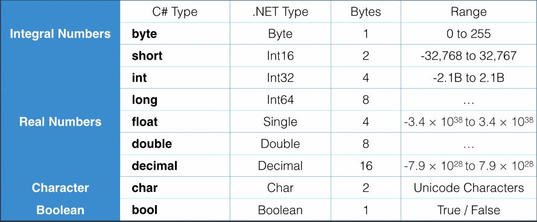
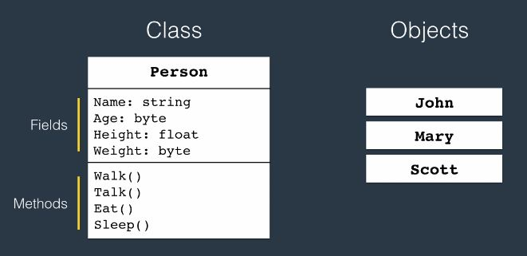
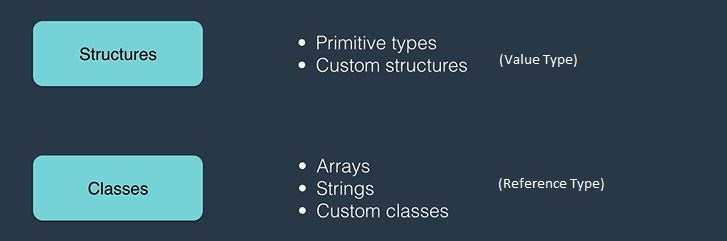

## Fundamentals
   
### namespaces
-  The .NET classes use namespaces to organize its many classes.
-  declaring my own namespaces can help control the scope of class and method names in larger programming projects.


### Variables / Constants
- Variable: a name given to a storage location in memory. It is written Camel Case like ```int myName``` 
- Constant: an immutable value. It is written Pascal Case like ```const int MyName```
### Primitive Types
- C# is a statically-typed, strongly-typed language. That means all variables must be declared to be of a specific type.
- When we compile C# data types, the compiler translate them to equivalent .NET type.
- C# keywords are always __Lowercase__.
- Each C# Types or Keywords maps to a type in .NET framework (like ```int``` to ```Int32```)
  

- ```double``` is the default datatype that C# uses for real numbers. So if we declare a float or decimal, we should say that to the compiler explicitly:
```csharp
float number = 1.2f;
decimal number = 1.2m;
```

### Type Conversion   
- Implicit (```int``` covers ```byte``` range)
```csharp
byte b = 1;
int i = b;
```
- Explicit
```csharp
// Won't Compile
int i = 1;
byte b = i;

//Needs Explicit Conversion to Compile
int i = 1;
byte b = (byte)i;
```
- Between non-compatible types
```csharp
// Won't Compile
string s = "1";
int i = (int)s;

// Needs non-compatible Conversion to Compile
string s = "1";

// Convert Class is part of Dot Net Framework and is defined in System Namespace.
// Int32 is a Dot Net Framework Type which Maps to the C# int type.
int i = Convert.ToInt32(s);

// All premetive types in C# have Parse Method.
int j = int.Parse(s);
```
### String VS Char
- ```string (C#) or String (.Net)``` is Class. It is Non-Primitive type like Array, Enum, Class.
- ```char (C#) or Char (.Net)``` is Structure. It is Primitive type like int, float, ....
### Format String
```csharp
Console.WriteLine("{0} {1}", byte. MinValue, byte. MaxValue);
```
## Class vs Object
- __Class__ is a type or blueprin from which we create __Object__. It is an __instance__ of the class.


- When we run the program, the __Objects__ are talking to each other to provide functionality.
- To create class we need __Access Modifier__ + __class keyword__ + __Identifier or class name__.
- Inside a class we might have __Variable or Field__ as well as __Method or Function__
```csharp
public class Person
{
    public string Name;
    public void Introduce()
    {
        Console.WriteLine("Hi, my name is" + Name);
    }
}
```
### Create Object
It is like __Primitive__ types but we have to allocate memory for the object using __new__ operator.
```csharp
int number; //No need to allocate memory for Primitive types
Person person = new Person();
```
When we use [ ] in declaration, behind the scene, the Array class gets called. So we need to allocate memory and initialize like classes. Also there is a shortcut to assign values to an array. Also we can use ```var```. 
```csharp
int[] number = new int[3] {1,2,3}
var number = new int[3] {1,2,3}
```
### Static Modifier
- If we add the __Static Modifier__ to the __add Method__ in calculate class we can access it directly from class and no need to create an instance.
- We __cannot__ access the Static methods from the objects.
- It means there is only __one__ instance from the Static class in memory.
```csharp
class Calculator
{
    public static int add(int a, int b)
    {
        return a + b;
    }
}
```
- Look at ```Console``` class in System namespace. the ```WriteLine``` method has defined as __Static__.
```csharp
Console.WriteLine("Reza Nikfal");
```
 - We don't need to create an instance of  ```Console``` class to make use of it.
 - There are just one __Console__ in the application and having several instances of Console doesn't make sence.
### String Class
- Create string:
```csharp
var firstName="Mosh"; //maps to System.String
string firstName="Mosh"; //maps to System.String
String firstName="Mosh"; // Direct usage. Needs to import System namespace
```
- Concatanate/Join using ```Format and Join``` static method on string class:
```csharp
var myFullName = string.Format("My name is {0} {1}", firstName, lastName);
var names = new string[3] { "John", "Jack", "Mary" };
var formattedNames = string.Join(",", names);
```
- The @ special character serves as a __verbatim__ identifier:
```csharp
var text = "Hi John\nLook into the following paths\nc:\\folder1\\folder2";
```
```csharp
var text = @"Hi John
Look into the following paths
c:\folder1\folder2";
```
### Enum Class
- To create a new type we use ```enum``` where you have a number of related constants. 
- Since it is a new type. It should be created at namespace level.
- It is internally integer so we can parse it to int and vice versa.
- We can convert a string to an enum using ```Enum.Parse``` class. It asks for __type object__ that represents the metadata of another type. To pass the type object we should use ```typeof(...)``` operator.
```csharp
namespace App1
{
    public enum ShippingMethod
    {
        AirMail=1,
        Ground = 2,
        Express =3
    }
    class Program
    {
        static void Main(string[] args)
        {
            var method = ShippingMethod.Express;
            Console.WriteLine((int)method);

            var methodId = 3;
            Console.WriteLine((ShippingMethod)methodId);

            Console.WriteLine(method.ToString());

            var methodName= "Express";
            var shippingMethod = (ShippingMethod)Enum.Parse(typeof(ShippingMethod), methodName);
        }
    }
}
```
### Value/Ref Type
When we copy an object depending on the type you get different results.




### DateTime & TimeSpan
```using System;``` means importing the __System Namespace__. A namespace is a container for related classes.
