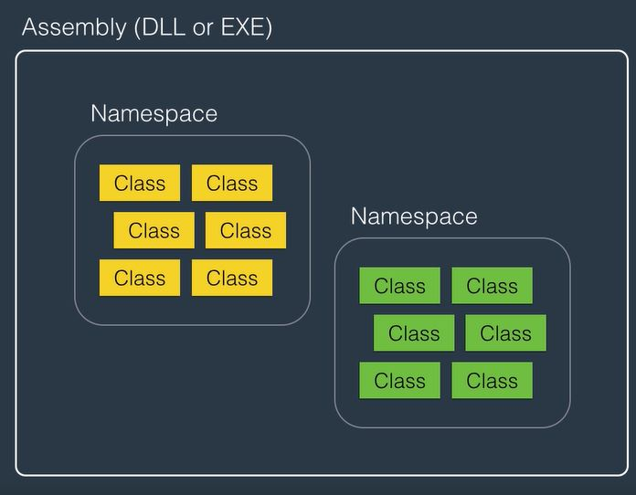
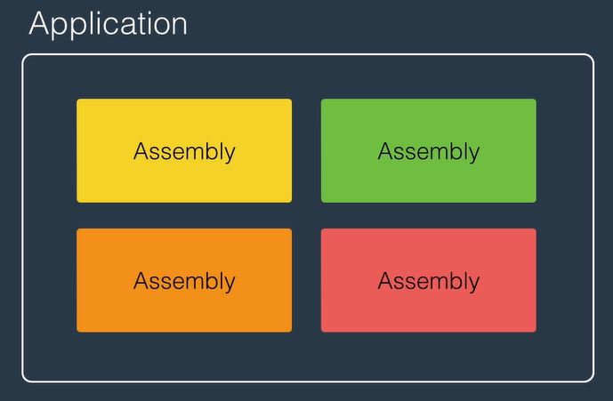

## Fundamentals
   
### Using Statement
```using System;``` means importing the __System Namespace__. A namespace is a container for related classes.

### DateTime & TimeSpan
```using System;``` means importing the __System Namespace__. A namespace is a container for related classes.
### String
```using System;``` means importing the __System Namespace__. A namespace is a container for related classes.
