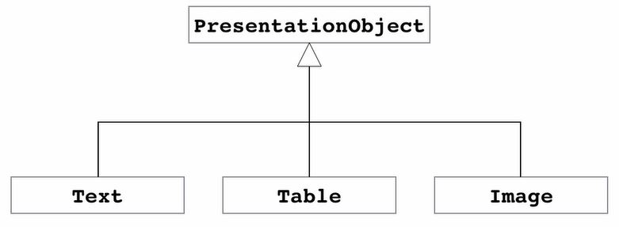

## Constructor
If we don't use Constructor in a class, C# compiler creates one to initialize all fields with their default values.
### Constructor Overloading
It means using multiple Constructor with different signature.
- It makes initialization of the class easier.
- Using ```: this()``` we can call the default or parameterless constructor.
```csharp
public class Customer
{
    public int Id;
    public string Name;
    public List<Order> Orders;
    public Customer()
    {
        Orders = new List<Order>();
    }
    public Customer(int id)
    : this()
    {
        this.Id = id;
    }
}
```
### Object Initializer
To avoid creating multiple Constructor to handle initializing an object.
```csharp
public class Person
{
    public int Id;
    public string FirstName;
    public string LastName;
    public DateTime Birthdate;
    }
```
```csharp
static void Main(string[] args)
{
    var person = new Person
    {
        FirstName = "Reza",
        LastName = "Nikfal"
    };
}
```
## Methods
Using one overload on the other and handle the exception using __Defensive Programming__.
```csharp
public void Move(int x, int y)
{
    this.X = x;
    this.Y = y;
}
public void Move(Point newLocation)
{
    if (newLocation == null)
    {
        throw new ArgumentNullException("newLocation");
    }
    Move(newLocation.X, newLocation.Y);
}
```
## Fields
- We can initialize _orders_ directly as follows or using constructor.
- Adding __readonly__ to make sure this field will be initialized just once.
```csharp
public class Customer
{
public int Id;
public string name;
public readonly List<order> orders = new List<order>();

public Customer(int id)
{
    Id = id;
}

public Customer(int id, string name) : this(id)
{
    this.name = name;
}     
```
## Properties
### Getter & Setter
- In C# we have 5 access modifiers: __public, private, protected, internal and protected internal__.
- We use access modifiers to hide the implementation details of a class. 
- Using getters and setters we can add logic to our fields. (like checking the null entry).
- __Private Fields__ starts with __Undeline__ and follows __camelCase__.
```csharp
public class Person
{
    private DateTime _birthdate;
    public void SetBirthdate(DateTime birthdate)
    {
        _birthdate = birthdate;
    }
    public DateTime GetBirthdate()
    {
        return _birthdate;
    }
}  
```
### Auto-implemented Property
When the C# compiler sees that, It internally creates the private field
```csharp
public class Person
{
    public DateTime Birthdate{ get; set;}
}  
```
### Read-only & Non-setable Property
- The read-only property could be set at constructor.
- Class element order: Properties - Empty Line - Constructor - Empty Line - Methods
```csharp
public class Person
{
    public string Name { get; set; }
    public string Username { get; set; }
    public DateTime Birthdate { get; private set; }

    public Person(DateTime birthdate)
    {
        Birthdate = birthdate;
    }

    public int Age
    {
        get
        {
            var timeSpan = DateTime.Today - Birthdate;
            var years = timeSpan.Days / 365;
            return years;
        }
    }
}
```
## Indexers
- Indexer is a special kind of property that allows accessing elements of a list by an index.
```csharp
public class HttpCookie
{
    private readonly Dictionary<string, string> _dictionary;
    public HttpCookie()
    {
        _dictionary = new Dictionary<string, string>();
    }
    public string this[string key]
    {
        get { return _dictionary[key]; }
        set { _dictionary[key] = value; }
    }
}
```
```csharp
class Program
{
    static void Main(string[] args)
    {
        var cookie = new HttpCookie();
        cookie["name"] = "Mosh";
        Console.WriteLine(cookie["name"]);
    }
}
```
## Inheritance
- Writing code once and re-use it in multiple context.
- UML is a graphical language to show classes and their collaboration.

