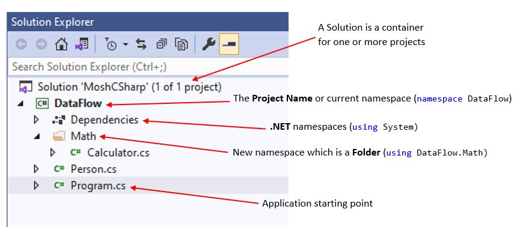

## Constructor
If we don't use Constructor in a class, C# compiler creates one to initialize all fields with their default values.
### Constructor Overloading
It means using multiple Constructor with different signature.
- It makes initialization of the class easier.
- Using ```: this()``` we can call the default constructor.
```csharp
public class Customer
{
    public int Id;
    public string Name;
    public List<Order> Orders;
    public Customer()
    {
        Orders = new List<Order>();
    }
    public Customer(int id)
    : this()
    {
        this.Id = id;
    }
}
```



