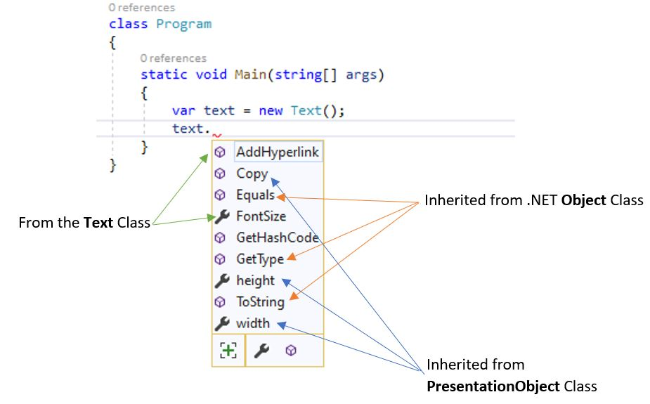
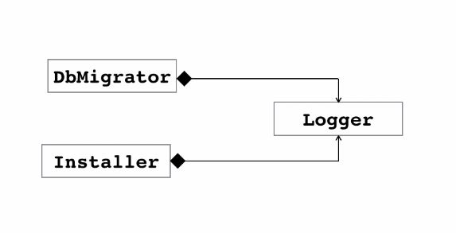
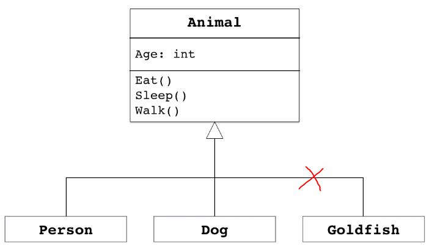
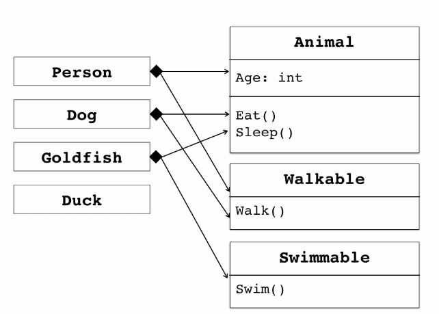

## Constructor
If we don't use Constructor in a class, C# compiler creates one to initialize all fields with their default values.
### Constructor Overloading
It means using multiple Constructor with different signature.
- It makes initialization of the class easier.
- Using ```: this()``` we can call the default or parameterless constructor.
```csharp
public class Customer
{
    public int Id;
    public string Name;
    public List<Order> Orders;
    public Customer()
    {
        Orders = new List<Order>();
    }
    public Customer(int id)
    : this()
    {
        this.Id = id;
    }
}
```
### Object Initializer
To avoid creating multiple Constructor to handle initializing an object.
```csharp
public class Person
{
    public int Id;
    public string FirstName;
    public string LastName;
    public DateTime Birthdate;
    }
```
```csharp
static void Main(string[] args)
{
    var person = new Person
    {
        FirstName = "Reza",
        LastName = "Nikfal"
    };
}
```
## Methods
Using one overload on the other and handle the exception using __Defensive Programming__.
```csharp
public void Move(int x, int y)
{
    this.X = x;
    this.Y = y;
}
public void Move(Point newLocation)
{
    if (newLocation == null)
    {
        throw new ArgumentNullException("newLocation");
    }
    Move(newLocation.X, newLocation.Y);
}
```
## Fields
- We can initialize _orders_ directly as follows or using constructor.
- Adding __readonly__ to make sure this field will be initialized just once.
```csharp
public class Customer
{
public int Id;
public string name;
public readonly List<order> orders = new List<order>();

public Customer(int id)
{
    Id = id;
}

public Customer(int id, string name) : this(id)
{
    this.name = name;
}     
```
## Properties
### Getter & Setter
- In C# we have 5 access modifiers: __public, private, protected, internal and protected internal__.
- We use access modifiers to hide the implementation details of a class. 
- Using getters and setters we can add logic to our fields. (like checking the null entry).
- __Private Fields__ starts with __Undeline__ and follows __camelCase__.
```csharp
public class Person
{
    private DateTime _birthdate;
    public void SetBirthdate(DateTime birthdate)
    {
        _birthdate = birthdate;
    }
    public DateTime GetBirthdate()
    {
        return _birthdate;
    }
}  
```
### Auto-implemented Property
When the C# compiler sees that, It internally creates the private field
```csharp
public class Person
{
    public DateTime Birthdate{ get; set;}
}  
```
### Read-only & Non-setable Property
- The read-only property could be set at constructor.
- Class element order: Properties - Empty Line - Constructor - Empty Line - Methods
```csharp
public class Person
{
    public string Name { get; set; }
    public string Username { get; set; }
    public DateTime Birthdate { get; private set; }

    public Person(DateTime birthdate)
    {
        Birthdate = birthdate;
    }

    public int Age
    {
        get
        {
            var timeSpan = DateTime.Today - Birthdate;
            var years = timeSpan.Days / 365;
            return years;
        }
    }
}
```
## Indexers
- Indexer is a special kind of property that allows accessing elements of a list by an index.
```csharp
public class HttpCookie
{
    private readonly Dictionary<string, string> _dictionary;
    public HttpCookie()
    {
        _dictionary = new Dictionary<string, string>();
    }
    public string this[string key]
    {
        get { return _dictionary[key]; }
        set { _dictionary[key] = value; }
    }
}
```
```csharp
class Program
{
    static void Main(string[] args)
    {
        var cookie = new HttpCookie();
        cookie["name"] = "Mosh";
        Console.WriteLine(cookie["name"]);
    }
}
```
## Inheritance
- Classes should not be aware of their details. That is the concept of __Encapsulation__.
- Writing code once and re-use it in multiple context.
- UML is a graphical language to show classes and their collaboration.
- Inheritance creates hierarchy that is fragile. it is against the __Encapsulation__ concept.


- Inheriting the __Text__ class from __PresentationObject__ class
```csharp
public class PresentationObject
{
    public int width { get; set; }
    public int height { get; set; }
    public void Copy()
    {
        Console.WriteLine("Copy the object");
    }
}
```
```csharp
public class Text : PresentationObject
{
    public int FontSize { get; set; }
    public void AddHyperlink()
    {
        System.Console.WriteLine("Hyperlink added");
    }
}
```


## Composition
- No special syntax. The class will be added to the Constructor. 


```csharp
public class Logger
{
    public void Log(string message)
    {
        Console.WriteLine(message);
    }
}
```
```csharp
public class DbMigrator
{
    private readonly Logger _logger;

    public DbMigrator(Logger logger)
    {
        _logger = logger;
    }

    public void Migrate()
    {
        _logger.Log("Logging through Logger class.");
    }
}
```
```csharp
static void Main(string[] args)
{
    var logger = new Logger();
    var migrator = new DbMigrator(logger);

    migrator.Migrate();

}
```
## Composition VS Inheritance
With composition, we get great flexibility as well as __loose coupling__.   


## Access Modifier
Other than __Public__, __Private__, __Protected__ (accessible in the inherited classes) there is __Internal__ which is accessible in the assembly.
### Create new assembly (dll)
- Right click on the current __Solution__ -> Create a __new Project__ -> Add __Class Library__.
- If we have to use any class from the new assemble (namespace) we should add its reference in the __Dependencies__. 
## UpCasting & DownCasting
- In .NET UpCasting (from a derived class or child to a base class or parent) is implicit and DownCasting is explicit.
```csharp
// Upcasting
Shape shape = circle;
// Downcasting
Circle circle = (Circle)shape;
Circle circle = shape as Circle;
if (circle != null)  // It works if we use 'as' keyboard
if (shape is Circle) // Make sure the Circle is drived from shape
```
## Polymorphism
### Method Overriding
- **Overriding** is changing the implementation of an inherited method VS **Overloading** means having methods with the same name and different signature.
- If a declare a method as **virtual** in the base class, we can override it in a derived class.
```csharp
public class Shape
{
    public virtual Draw()
    {
        // Default implementation for all derived classes
    }
}

public class Circle : Shape
{
    public override Draw()
    {
        // Changed implementation
    }
}
```
### Abstract Classes
- Abstract modifier states that a class or a member misses implementation.
- **All** abstract members **must** be overrided in the inherited class.
- We cannot instantiate abstract classes.
- Abstract class is too abstract to have implementation. Like implementing ```Draw``` method in the ```Shape Class``` that doesn't make any sense.
```csharp
public abstract class Shape
{
    // This method doesn’t have a body. 
    public abstract void Draw();
    public void copy()
    {
        // has implementation
    }
}
public class Circle : Shape
{
    public override void Draw()
    {
        // implementation
    }
}
```
### Sealed Classes
If Sealed modifier is applied to a class, it prevents derivation from that class. Not very usable.
### OCP (open–closed principle)
Software entities should be **open** for extension, but **closed** for modification.
## Interfaces
### Testability
A class that has tight dependencies to other classes cannot be isolated in order to unit test. To solve this problem, we use an interface to create loose coupling.
### Extensibility
- We can use interfaces to change our application’s behaviour by “extending” its code (rather than changing the existing code).
- If a class is dependent on an interface, we can supply a different implementation of that interface at runtime. This way, the behaviour of the application changes without any impact on that class.
```csharp
namespace Extensibility
{
    public class DbMigrator
    {
        public void Migrate()
        {
            Console.WriteLine("Migrationg started at {0}", DateTime.Now);
            // Details of migrating the database
            Console.WriteLine("Migrationg finished at {0}", DateTime.Now);
        }
    }
}
```
- Interface:
```csharp
public interface Ilogger
{
    void LogError(string message);
    void LogInfo(string message);
}
```
- Dependency Injection (In constructor we are specifying the dependencies as Interface and later in the main method we specify the concrete class)
```csharp
namespace Extensibility
{
    public class DbMigrator
    {
        private readonly Ilogger _logger;
        public DbMigrator(Ilogger logger)
        {
            _logger = logger;
        }
        public void Migrate()
        {
            _logger.LogInfo("Migrationg started at {@}" + DateTime.Now);
            // Details of migrating the database
            _logger.LogInfo("Migrationg finished at {0}" + DateTime.Now);
        }
    }
}
```
- The **concrete** class that implements the ```ILogger``` interface.
```csharp
public class ConsoleLogger : ILogger
{
    public void LogError(string message)
    {
        Console.ForegroundColor = ConsoleColor.Red;
        Console.WriteLine(message);
    }
    public void LogInfo(string message)
    {
        Console.ForegroundColor = ConsoleColor.Green;
        Console.WriteLine(message);
    }
}
```
- The **Main** method in the Program class.
- We create an instance of ```DbMigrator``` class and pass ```ConsoleLogger()``` class as its parameter.
- We can easily replace the ```ConsoleLogger()``` class with any other implementation like ```MemoryLogger()``` or ```FileLogger()```.
```csharp
class Program
{
    static void Main(string[] args)
    {
        var dbMigrator = new DbMigrator(new ConsoleLogger());
        dbMigrator.Migrate();
    }
}
```
