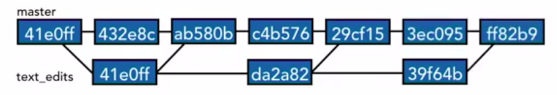
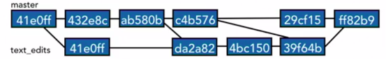

## Re-Commit to the LATEST commit (amend)  
If you make a mistake on the name of the recent commit or need to make some changes on the recent commit's code  
`$ git commit --amend`   
`$ git commit --amend -m "new message"`

## Undo Changes (revert)  
When you need to undo any changes. If it is not the recent commit, To avoid conflict, the change should not be touched.  
`$ git revert <commit>`   

## Compare Branches
The older branch should go first (General rule).  
`$ git diff master..feature`   
Check the branches that is included in the current branch(master).  
`$ git branch --merged`  
`Reza11`  
`*master`

## Reset Branches
Move HEAD pointer to a specific commit. Be careful about amending commits which have been shared.   
### Soft
- Return to an old state and leave code changes __staged__.  
- Useful for amending one or more commits as a unique commit.   
### Mixed
- Like Soft Reset, Return to an old state and leave code changes in __working directory__.  
- Useful for reorganizing commits. 
### Hard
- Return to an old state and __discard__ all code changes.
- Useful to permanently undo commits. 

## Merge Branches
Always run Merges with clean working directory (Commit or Stash changes).  
### Fast-forward Commit
- When there is no commits in the master after the branch was made. 
- The branch is an extension of the master.
- The branch can be moved inline with the master with no need to a new commit.
### Cancel Merge
To cancel merge __Reset Hard__ to the commit right before the join commit in the mater branch.
### Reduce Conflicts
- Merge to master branch more often and continue to work on your own branch. 
 
- Track changes to master.  
 
 
## Git Stash
- Help to checkout to other branch without commitimg current changes.
- Stashes are independent of the branches that you're on. So, you could stash something on the master branch and use it in a different branch.
- Taking a snapshot of a change and storing it away 'til later.
- `git stash Pop/Apply/Drop` to retieve and delete, just retieve, and just delet the stash.  

