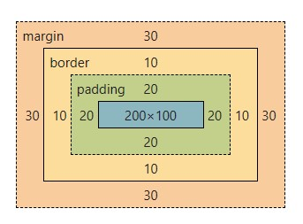

### CSS Variables / root / first-child / nth-child
- CSS vars are often used to store colors, font sizes, spacing, or other values that are used repeatedly in a stylesheet.
- CSS variables are defined using the ```--``` prefix followed by a name.
- The ```var()``` function is used to reference the values of the variables.
- CSS vars follows the scope.
- The ```:root``` pseudo-class in CSS is a selector that matches the highest-level parent element, which is typically the <html> element.
```css
/* Declare variables */
:root {
  --main-color: #3498db;
  --font-size: 16px;
  --spacing: 10px;
}

/* Use variables in styles */
body {
  color: var(--main-color);
  font-size: var(--font-size);
}

h1 {
  margin-bottom: var(--spacing);
}
```
- The ```:first-child``` pseudo-class selects the first child element of its parent.
- The ```:nth-child()``` pseudo-class allows you to select elements based on their position in a parent container.
```css
ul li:first-child {
  font-weight: bold;
}

ul li:nth-child(odd) {
  background-color: #f0f0f0;
}

ul li:nth-child(3n+1) {  // should be "n" and n starts from 0. So here it impacts the elements No. 1, 4, 7, ...
  background-color: #f0f0f0;
}
```
### pseudo-elements
- Pseudo-elements are CSS selectors that enable you to style a specific part of an element. .
- They are denoted by a double colon (::) followed by the name of the pseudo-element.
- Some of the main pseudo-elements: ```::before```, ```::after```, ```::first-line```, ```::first-letter``` and ```::selection```
- ```::before``` and ```::after``` works just with ```content```. You don't have access to it from JS. They are not part of DOM.
```css
<p class="pClass">This text should be red when selected.</p>

//Before This text should be red when selected. After

.pClass::before {
  content: "Before ";
}

.pClass::after {
  content: " After";
}
```
### attr() function
- The ```attr()``` function is used to retrieve and use the value of an HTML attribute and incorporate it into the styling of an element.
- You can add any other attributes using this format: ```data-*```
```css
<a id="Reza" href="https://www.example.com" class="external-link">Visit Example</a>

.external-link::after {
  content: attr(id);
  /* Visit ExampleReza */
}
.external-link::after {
  content: " (" attr(href) ")";
  /* Visit Example (https://www.example.com) */
}

<div data-text="Hello, World!" class="dynamic-content"></div>

.dynamic-content::before {
  content: attr(data-text);
  /* Hello, World! */
}

```
### calc() function
- Using ```calc()``` you can create dynamic elements.
- You can combine 2 different units like ```px``` and ```em```.
- You can use variables with calc.
```css
:root{
--standard-font-size: 20px;
--h1-font-size: calc(var(--standard-font-size) * 2)
}
.container {
  width: calc(100% - 20px);
  margin: calc(10px + 5%);
  font-size: calc(16px + 2vmin);
}
.element {
  width: calc((100vw - 2 * 20px) / 3);  // the element width gets updated with resizing the browser window.
  height: calc(50vh - 40px);
  padding: calc(2em + 2px);
}
```
### Attribute selectors
- These attribute selectors provide a powerful way to target and style elements based on the attributes they possess
- We use ```[]``` for this type of selectors.
```css
<div data-text="Reza" class="dynamic-content">Hello World</div>

[data-text] {
  font-size: 50px;
}

/* Selects elements with a specified attribute and value. */
[type="submit"] {
  background-color: #4caf50;
  color: white;
}

/* Selects elements with a specified attribute containing a specified value. */
[href*="example.com"] {
  color: blue;
}

/* Selects elements with a specified attribute value that starts with a specified value. */
[class^="prefix"] {
  font-weight: bold;
}

/* Selects elements with a specified attribute value that ends with a specified value. */
[src$=".png"] {
  border: 1px solid red;
}
```
### CSS Tricks
- ```.class1 > div``` targets a ```div``` element that is a **direct** child of an element with the ```class1```.
- ```.class1 div``` targets any ```div``` element that is a **descendant** of an element with the ```class1```.
- ```.class1 + div``` targets ```div``` element that is **immediately sibling** preceded by an element with the class ```class1```.
- ```.class1 ~ div``` targets **all** ```div``` elements that are **siblings** preceded by an element with the class ```class1```.
- ```.class1.class2``` targets elements that have **both** classes applied.
- ```.class1 .class2``` targets elements with ```class2``` that are **descendants** of elements with ```class1```.
```html
<div class="class1">
  <div>First div</div> <!-- This div is targeted by .class1 > div -->
  <div> <!-- This div is targeted by .class1 > div -->
    <div>Targeted by .class1 div</div> <!-- This div is targeted by .class1 div -->
  </div>
</div>
```
- Here just **Fist** will be impacted.
```html
.divClass + div {
  font-size: 50px;
  font-style: italic;
}

<div class="divClass"></div>
<div>First</div>
<div>Second</div>
```
### Create List from ```divs``` (React)
```javascript
export default function SingleItem({ item }) {
    return (
        <div className="item">
            <div>{item.name}</div>
            <div>{item.quantity}</div>
            <div>${item.price}</div>
            <div>${item.price * item.quantity}</div>
            <div className="close">X</div>
        </div>
    )
}
```
```css
.item {
  display: flex;
  justify-content: space-between;
  align-items: center;
}

.item > div {
  flex: 1;
  text-align: center;
  margin: 0.5rem 0;
}

.item:nth-child(even) {
  background-color: blanchedalmond;
}

.item .close {
  flex: 0.3;
  font-weight: bold;
  cursor: pointer;
}
```
 

### Flebox ```flex: 1``` VS ```justify-content```
```html
<div className='allTabs'>
  <div>Tab-1</div>
  <div>Tab-2</div>
  <div>Tab-3</div>
</div>
```
```css
.allTabs {
  display: flex;
}

.allTabs > div {
  flex: 1;
  text-align: center;
  background-color: bisque;
  border: 1px solid coral;
}
```


```css
.allTabs {
  display: flex;
  justify-content: space-around;
}

.allTabs > div {
  background-color: bisque;
  border: 1px solid coral;
}
```
 

## box-sizing
- **box-sizing: border-box**;
- The width and height properties include the padding and border, but not the margin.
- By default **box-sizing : content-box**, the width and height properties only apply to the content of the element. This means that any **padding or border you add to the element will increase its total size**
```css
.bBox {
  width: 200px;
  height: 100px;
  padding: 20px;
  border: 10px solid red;
  margin: 30px;
  background-color: aqua;
}
```


```css
* {
  box-sizing: border-box;
}

.bBox {
  width: 200px;
  height: 100px;
  padding: 20px;
  border: 10px solid red;
  margin: 30px;
  background-color: aqua;
}
```


## Create / Edit SVG
- Go to [Boxy SVG](https://boxy-svg.com/app "Boxy SVG").
- Create a path using ```Cubic Bezier```.
- Replace the inside code ```d="M19 3H5a2 2 0 0 0-2 2v1...``` with the existing SVG that you wish to edit.
- make some changes using ```Edit``` and ```Transform``` tools.
Example:
- Existing:
```html
<svg viewBox="-3 -3 30 30" id="tracking" preserveAspectRatio="xMidYMid meet"
  [ngStyle]="{fill:trackingTabActive?'#8AB4F8':'#ffffff'}">
  <g viewBox="-3 -3 30 30">
    <path id="cartesian"
    d="M19 3H5a2 2 0 0 0-2 2v14c0 1.1.9 2 2 2h14a2 2 0 0 0 2-2V5a2 2 0 0 0-2-2zm0 16H5V5h14v14z"></path>
  </g>
</svg>
```
- Edited:
```html
<svg viewBox="-3 -3 30 30" id="tracking" preserveAspectRatio="xMidYMid meet"
  [ngStyle]="{fill:trackingTabActive?'#8AB4F8':'#ffffff'}">
  <g viewBox="-3 -3 30 30">
    <path id="cartesian"
    d="M19 3H5a2 2 0 0 0-2 2v14c0 1.1.9 2 2 2h14a2 2 0 0 0 2-2V5a2 2 0 0 0-2-2zm0 16H5V5h14v14z"></path>
    <path id="cartesian" 
    d="M 6.654 13.927 L 10.052 10.621 L 12.147 12.446 L 15.644 8.945 L 17.257 10.63 L 12.112 15.658 L 9.917 13.671 L 8.173 15.433 L 6.654 13.927 Z"></path>
  </g>
</svg>
```
### Snapshot of the SVG


### CSS absolute / relative Units
- **px** (Pixels): This is the most commonly used unit. One pixel is a single dot on a screen.
- **em**: This unit is also relative to the font size of the parent element.
- **rem** (Root EM): Similar to em, but it's always relative to the font size of the root element (usually the ```<html>``` tag),
- By default the font size in in browsers is 16px so rem = 16px

