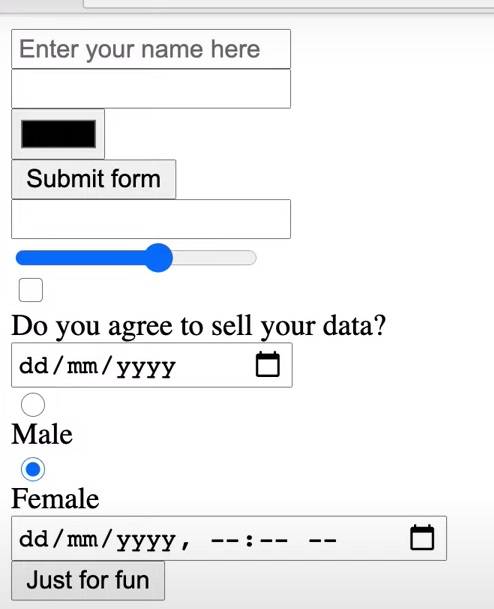

# HTML 5
### HTML 4.01 vs HTML 5
- HTML5 introduces new semantic elements like ```<article>, <section>, <header>, <nav>, <footer>```.
- HTML5 Introduces the ```<canvas>``` element for drawing graphics and the ```<svg>```.
- HTML5 Introduces the **localStorage** and **sessionStorage** APIs vs HTML 4.01 **cookies**.
```html
<!DOCTYPE html>
<html lang="en">
<head>
    <meta charset="UTF-8">
    <meta name="viewport" content="width=device-width, initial-scale=1.0">
    <title>HTML5 Sample</title>
</head>
<body>

    <header>
        <h1>Welcome to My Website</h1>
    </header>

    <section id="about">
        <h2>About Section</h2>
        <p>This is the main content of the about section.</p>
    </section>

    <footer>
        <p>&copy; 2023 My Website. All rights reserved.</p>
    </footer>

</body>
</html>
```
### meta tag (single tag)
- SEO meta tags are HTML tags that provide information about a web page to search engines and website visitors.
- The most important one:
  - Meta **title** Tag
  - Meta **name/content** Tag
  - Meta **Keywords** Tag
```html
<title>Your Page Title</title>
<meta name="description" content="This is a brief description of your webpage.">
<meta name="keywords" content="SEO, meta tags, web development">
```
### HTML 5 entity
- For example HTML collapses spaces, to address this and other special characters we use entity.
- These entities are written using the ```&``` character followed by a specific keyword and ending with a semicolon ```;```.
```html
<p>the words: Hello&nbsp;&nbsp;&nbsp;World</p>  // Hello   World
<p>less than symbol: &lt;</p>  // less than symbol: <
```
### input values
```html
<input type="text">
<input type="password">
<input type="email">
<input type="url">
<input type="number">
<input type="date">
<input type="checkbox">
<input type="radio">
<input type="file">
<input type="search">
<input type="color">
<input type="range">
```


- To create a group of radio buttons, you give them the same name attribute.
```html
<input type="radio" name="gender" value="male">
<input type="radio" name="gender" value="female">
<input type="radio" name="gender" value="other">
```
    
### iframe
- An <iframe> (inline frame) is an HTML element that allows you to embed another websites within the current HTML document.
```html
    <iframe
      src="https://www.example.com"
      width="600"
      height="400"
      frameborder="5px"
    ></iframe>
    <iframe
      width="800"
      height="800"
      src="https://www.youtube.com/embed/kfyW8rdzieo?si=Chj_LSsFg01BA-W-"
      title="YouTube video player"
      frameborder="0"
      allow="accelerometer; autoplay; clipboard-write; encrypted-media; gyroscope; picture-in-picture; web-share"
      allowfullscreen
    ></iframe>
```
    
### &lt;pre&gt; tag
- text inside a ```<pre>``` element is displayed in a way that preserves both spaces and line breaks.
    
### Table
- ```<table><thead><tbody>```: Encloses the entire **table/header/body** structure.
- ```<tr>```: Defines a table **row**.
- ```<th>```: Defines a table **header** cell (bold and centered by default).
- ```<td>```: Defines a table **data** cell.
- ```colSpan```: It allows you to **merge multiple cells** horizontally to create a single cell.
```html
<table>
  <caption>Fruit Prices</caption>
  <thead>
    <tr>
      <th>Fruit</th>
      <th>Number</th>
      <th>Price</th>
    </tr>
  </thead>
  <tbody>
    <tr>
      <td>Apple</td>
      <td>10</td>
      <td>$1.50</td>
    </tr>
    <tr>
      <td>Banana</td>
      <td>5</td>
      <td>$0.75</td>
    </tr>
    <tr>
      <td colSpan={2}>Total</td>
      <td>$2.25</td>
    </tr>
  </tbody>
</table>
```
