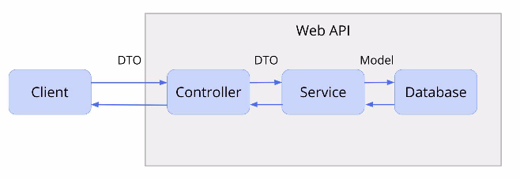

## After installation in VS-Code
### Problem with globalization [(Link)](https://docs.microsoft.com/en-us/dotnet/core/run-time-config/globalization")
dotnet run does not work.  
In `PROJECT_NAME/bin/Debug/netcoreapp3.1/PROJECT_NAME.runtimeconfig.json` make the following change:
```yaml
{
  "runtimeOptions": {
    "tfm": "netcoreapp3.1",
    "framework": {
      "name": "Microsoft.AspNetCore.App",
      "version": "3.1.0"
    },
    "configProperties": {
      "System.GC.Server": true,
      "System.Globalization.Invariant": true
    }
  }
}
```
### Error with C# Extension [(Link)](https://stackoverflow.com/a/54359872/6227809")
Omnisharp can't find .NET SDK when open any C sharp project ...   
For Ubuntu & Snap use this instead:
```javascript
$ sudo ln -s /snap/dotnet-sdk/current/dotnet /usr/local/bin/
```
## Udemy Course (.NET Core 3.1 Jumpstart)
### Controller:
- It should be pretty simple, just forward data to the service and result to the client.
- To to so we __Inject__ necessary services to the controller to make use of it.
 

### DTO (Data Transfer Object) vs Model
- We use DTOs to __comunication between client & server__.
- __Model__ maps to the database (Representation of database table).
- We remove some elements of model in DTO that we don't need to show to the user.

### Create & Inject Services
We need to create a service class (i.e. `CharacterService`) and an Interface (i.e. `ICharacterService`)  
#### Interface
An interface contains definitions for a group of related functionalities that a class must implement.
- Syntax: Type + Name + Parameter
```csharp
namespace dotnet_rpg.Services.CharacterService
{
    public interface ICharacterService
    {
        List<Character> GetAllCharacters();
        Character  GetCharacterById (int id);
        List<Character>  AddCharacter (Character newCharacter);

    }
}
```
#### Class
```csharp
namespace dotnet_rpg.Services.CharacterService
{
    public class CharacterService : ICharacterService
    {
        // Provides data istead of DB
        private static List<Character> characters = new List<Character>{
            new Character(),
            new Character{Id=1,Name = "Sam"}
        };
        public List<Character> AddCharacter(Character newCharacter)
        {
            characters.Add(newCharacter);
            return characters;
        }

        public List<Character> GetAllCharacters()
        {
            return characters;
        }

        public Character GetCharacterById(int id)
        {
            return characters.FirstOrDefault(c => c.Id == id);
        }
    }
}
```
#### Inject Service in the Controller
